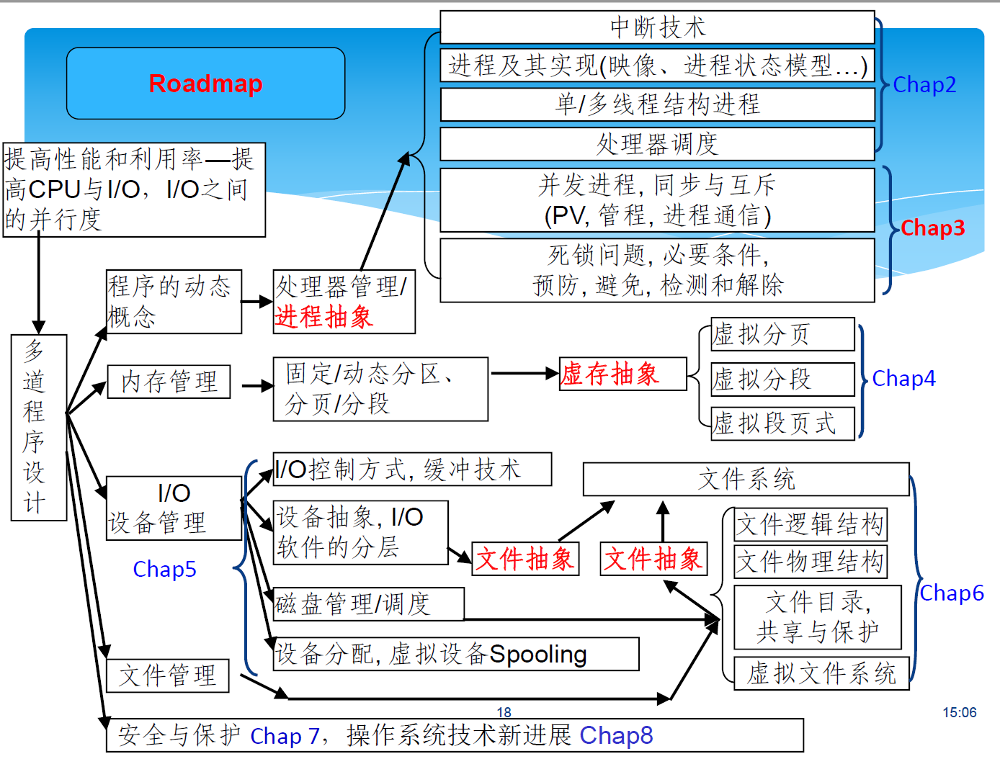

Exam1-复习
---

<!-- TOC -->

- [1. 课程学习目标](#1-课程学习目标)
- [2. 操作系统课程的教学原则](#2-操作系统课程的教学原则)
- [3. 考研题型分析](#3-考研题型分析)
  - [3.1. 全国统考考察目标](#31-全国统考考察目标)
  - [3.2. 操作系统概述 (Chap 1)](#32-操作系统概述-chap-1)
  - [3.3. 进程管理 (Chap 2.3~2.4)](#33-进程管理-chap-2324)
    - [3.3.1. 进程与线程](#331-进程与线程)
    - [3.3.2. 处理机调度 (2.6~2.7)](#332-处理机调度-2627)
    - [3.3.3. 进程同步 (Chap3)](#333-进程同步-chap3)
    - [3.3.4. 死锁 (Chap 3.7)](#334-死锁-chap-37)
  - [3.4. 内存管理 (Chap 4.1~4.4)](#34-内存管理-chap-4144)
    - [3.4.1. 内存管理基础](#341-内存管理基础)
    - [3.4.2. 虚拟内存管理 (Chap 4.5~4.7)](#342-虚拟内存管理-chap-4547)
  - [3.5. 文件管理 (Chap 6)](#35-文件管理-chap-6)
    - [3.5.1. 文件系统基础](#351-文件系统基础)
    - [3.5.2. 文件系统基础 (chap 6.4)](#352-文件系统基础-chap-64)
    - [3.5.3. 磁盘组织与管理 (chap 5.4)](#353-磁盘组织与管理-chap-54)
  - [3.6. 输入输出(I/O)管理](#36-输入输出io管理)
    - [3.6.1. 输入输出(I/O)管理 (Chap 5)](#361-输入输出io管理-chap-5)
    - [3.6.2. I/O核心子系统](#362-io核心子系统)
- [4. 期末考试题型](#4-期末考试题型)
  - [4.1. 计算题型分析](#41-计算题型分析)
  - [4.2. 示例题目](#42-示例题目)
    - [4.2.1. 时间片调度算法](#421-时间片调度算法)
    - [4.2.2. 处理器调度算法](#422-处理器调度算法)
    - [4.2.3. 页面调度算法](#423-页面调度算法)
    - [4.2.4. 银行家算法](#424-银行家算法)
    - [4.2.5. PV操作](#425-pv操作)

<!-- /TOC -->

# 1. 课程学习目标
1. 明确计算机操作系统的作用与功能
2. 掌握操作系统实现的基本原理与方法
   1. 在微观上，掌握设计实现各个操作系统模块的方法、策略与算法
   2. 在宏观上，掌握操作系统的结构和设计实现方法，进一步了解大型软件系统的结构和设计实现方法
3. 掌握并发程序设计的基本方法

# 2. 操作系统课程的教学原则
1. 用系统的观点、全局的观点、整体的观点来看待操作系统的实现
2. 理解软硬件协同解决问题的方法
3. 理解分而治之、分层实现在复杂软件系统实现中的重要作用
4. 用工程师的立场来看待操作系统的实现
5. 理解文化在操作系统实现中的重要作用

# 3. 考研题型分析
1. 单项选择题
   1. 概念为主
   2. 小型计算题
2. 综合应用题
   1. 算法题(计算)
   2. 互斥与同步问题：信号量与PV操作、管程方法

## 3.1. 全国统考考察目标
1. 了解操作系统在计算机系统中的作用、地位、发展和特点。
2. 理解操作系统的基本概念、原理，掌握操作系统设计方法与实现技术。
3. 能够运用所学的操作系统原理、方法与技术分析问题和解决问题。

## 3.2. 操作系统概述 (Chap 1)
1. 操作系统的概念、特征、功能和提供的服务
2. 操作系统的发展与分类
3. 操作系统的运行环境

## 3.3. 进程管理 (Chap 2.3~2.4)

### 3.3.1. 进程与线程
1. 进程概念 (2.2)
2. 进程的状态与转换 (2.3)
3. 进程控制 (2.3)
4. 进程组织 (2.3) (进程的队列)
5. 进程通信 (3.5) (共享存储系统；消息传递
系统；管道通信)
6. 线程概念与多线程模型 (2.4)

### 3.3.2. 处理机调度 (2.6~2.7)
1. 调度的基本概念 (2.6)
2. 调度时机、切换与过程 (2.6)
3. 调度的基本准则 (2.6)
4. 调度方式抢占与非抢占
5. 典型调度算法 (2.6)：先来先服务调度算法；短作业(短任务、短进程、短线程)优先调度算法；时间片轮转调度算法；优先级调度算法；高响应比优先调度算法；多级反馈队列调度算法。

### 3.3.3. 进程同步 (Chap3)
1. 进程同步的基本概念 (3.1)
2. 实现临界区互斥的基本方法 (3.2)
   1. 软件实现方法；硬件实现方法。
3. 信号量 (3.3)
4. 管程 (3.4)
5. 经典同步问题 (3.3~3.4)
   1. 生产者-消费者问题
   2. 读者-写者问题
   3. 哲学家进餐问题

### 3.3.4. 死锁 (Chap 3.7)
1. 死锁的概念
2. 死锁处理策略
3. 死锁预防
4. 死锁避免
   1. 系统安全状态：银行家算法。
5. 死锁检测和解除

## 3.4. 内存管理 (Chap 4.1~4.4)

### 3.4.1. 内存管理基础
1. 内存管理概念
– 程序装入与链接；逻辑地址与物理地址
空间；内存保护。
2. 交换与覆盖
3. 连续分配管理方式
– 单一连续分配；分区分配。
4. 非连续分配管理方式:分页管理方式；分
段管理方式；段页式管理方式。

### 3.4.2. 虚拟内存管理 (Chap 4.5~4.7)
1. 虚拟内存基本概念
2. 请求分页管理方式
3. 页面置换算法 : 最佳置换算法(OPT)；先进先出置换算法(FIFO)；最近最少使用置换算法(LRU)；时钟置换算法(CLOCK)。
4. 页面分配策略
5. 抖动 : 抖动现象；工作集。
6. 请求分段管理方式
7. 请求段页式管理方式

## 3.5. 文件管理 (Chap 6)

### 3.5.1. 文件系统基础
1. 文件概念
2. 文件结构
   1. 顺序文件；索引文件；索引顺序文件。
3. 目录结构
   1. 文件控制块和索引节点；单级目录结构和两级目录结构；树形目录结构；图形目录结构。
4. 文件共享
   1. 共享动机；共享方式；共享语义。
5. 文件保护
   1. 访问类型；访问控制。

### 3.5.2. 文件系统基础 (chap 6.4)
1. 文件系统实现
2. 文件系统层次结构
3. 目录实现
4. 文件实现

### 3.5.3. 磁盘组织与管理 (chap 5.4)
1. 磁盘的结构
2. 磁盘调度算法
3. 磁盘的管理

## 3.6. 输入输出(I/O)管理

### 3.6.1. 输入输出(I/O)管理 (Chap 5)
1. I/O管理概述
2. I/O设备
3. I/O管理目标
4. I/O管理功能
5. I/O应用接口
6. I/O控制方式

### 3.6.2. I/O核心子系统
1. I/O调度概念
2. 高速缓存与缓冲区
3. 设备分配与回收
4. 假脱机技术(SPOOLing)(5.6)
5. 出错处理

# 4. 期末考试题型
1. 选择题 (50分):重难点
2. 简答题 (12分):概念、名词解释
3. 计算题/应用题/算法题 (38分)：课后习题

1. 操作系统问题源头 —— 三个抽象
   1. 进程抽象：动态并入：多道程序设计，中断设置，基础硬件、软件
   2. 虚存抽象：单个进程时间变长
   3. 文件抽象：按名存取、Spooling系统等
2. 教材第七章和第八章不作为考试要求。
3. 重点的部分
   1. 系统调用的实现过程图
   2. 三状态模型及其转换
   3. 用户级线程和内核级线程：
      1. 用户级线程是内核不直接参与到进程调度，首先将处理器分配给进程，然后由进程来给线程
      2. 内核级线程是内核直接参与到进程调度中去，可以直接将处理器分配给线程
   4. 混合型线程
   5. 分页/分段/段页式虚拟存储
   6. 缺页中断的处理流程
   7. 反置页表的原理：节省页表项在内存中的开销，以页框项来存储。
   8. 作业调度和进程调度区别
   9. 目录项、inode和数据块的关系

## 4.1. 计算题型分析
1. **多道程序设计**
2. **CPU调度算法**
3. **死锁避免银行家算法 ，死锁检测**
4. 连续分配，分区分配：适配算法，伙伴系统
5. **地址转换计算：分页管理方式；分段管理方式。**
6. **页面置换算法**
7. 抖动现象，工作集
8. **磁盘调度算法**
9. **文件系统的计算**
10. **PV操作**、管程

## 4.2. 示例题目
详见Word

### 4.2.1. 时间片调度算法
1. 第五题：时间片长度：宏观理解，调度时内存中有哪些进程，这些进程来评分CPU时间，忽略进程切换的时间开销

### 4.2.2. 处理器调度算法

### 4.2.3. 页面调度算法
1. 全局页面替换算法：课本：224-229
2. 局部页面替换算法不考

### 4.2.4. 银行家算法

### 4.2.5. PV操作