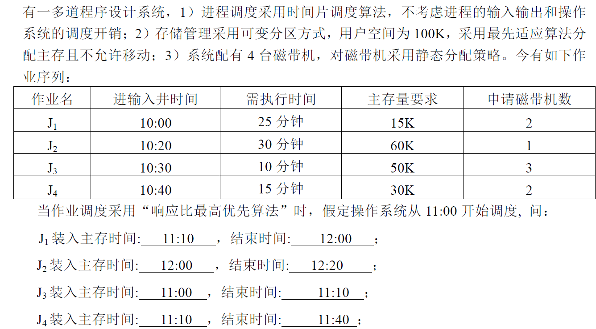

Exam2-考试
---

<!-- TOC -->

- [1. 选择题](#1-选择题)
- [2. 简答题](#2-简答题)
- [3. 应用题](#3-应用题)
  - [3.1. 最高响应比优先算法](#31-最高响应比优先算法)
  - [3.2. LRU算法](#32-lru算法)

<!-- /TOC -->

# 1. 选择题
1. FIFO导致Belady异常
2. **分时**操作系统允许在一台主机上同时联接多台终端，多个用户可以通过各自的终端同时交互使用计算机。
3. 时间：
   1. 周转时间：提交到完成
   2. 带权周转时间：先用任务时间平均
4. Unix系统中，文件的**索引结构**存放在inode中
5. Linux系统中的slab分配器，采用**伙伴系统**内存管理方式
6. 3个并发进程，都需要同类资源4个，不会发生死锁最少10个资源。
7. 某系统中有11台打印机，N个进程共享打印机资源，每个进程要求3台，当N不超过**5**时，系统不会死锁。
8. 多道程序设计技术前提是**中断**
9. 通道程序由一系列**通道指令**组成
10. 在I/O分层结构中，设备驱动程序负责将把用户提交的**逻辑I/O请求**转化为**物理I/O操作**的启动和执行。
11. 4KB的页，页内偏移占**12位**
12. 操作系统中，临界区是一段**程序**
13. 实模式下16位CPU使用段偏移的选址能力是**1M**
14. 不是从实模式进入保护模式的指令：
    1. lgdt[GdtPtr]
    2. out 92h, al
    3. **jump $** √ 死循环
    4. mov cr0, eax
15. C语言的调用汇编，**C使用extern，汇编使用Global**
16. 死锁定理用于**死锁检测**
17. 无结构文件即**流式文件**
18. 下列文件中属于逻辑结构的文件是**流式文件**
19. 物理文件包含**连续(顺式)、链接、索引文件**
20. 磁盘的读写的基本单位是**扇区**
21. V操作将被唤醒进程转为**就绪态**
22. 配置了操作系统的机器是一台比原来的物理机器功能更强的计算机，这样的计算机只是一台逻辑上的计算机，称为**虚拟**计算机。
23. **管态：核心态**
24. **中断**不属于操作系统所管理的资源
25. 当时间片到时，进程从**运行状态变为就绪状态**
26. 原语的特征是**不可分割性**
27. 内核级线程：控制权从一个线程传送到另一个线程时不需要用户态-内核态-用户态的模式切换，**错误**
28. 对进程的管理和控制使用**原语**
29. 一个可共享的程序在执行过程中是不能被修改的，这样的程序代码应该是**可重入**代码
30. 静态重定向时机是**程序装入**时
31. 能够装入内存任何位置的代码程序必须是**可动态链接**的
32. 块是对文件系统而言，**扇区**是对磁盘而言。
33. 存储管理中，采用覆盖与交换技术的目的是物理上**扩充主存容量**
34. 在分区存储管理中，**首次适应法**最有可能使得高地址空间变成为大的空闲区。
35. LRU置换算法的思想：**在最近的过去很久未使用的在最近的将来也不会使用**
36. 段页式是**二维**地址空间
37. 为了使多个进程能有效地同时处理输入和输出，最好使用**缓冲池**结构的缓冲技术。
38. 采用假脱机技术，将磁盘的一部分作为公共缓冲区以代替打印机，用户对打印机的操作实际上是对磁盘的存储操作，用以代替打印机的部分是**虚拟设备**
39. 将系统中的每一台设备按某种原则进行统一的编号, 这些编号作为区分硬件和识别设备的代号，该编号称为设备的**绝对号**
40. 采用SPOOLing技术的系统中，用户的打印结果首先被送到**磁盘固定区域**
41. 大多低速设备都属于**独享**设备
42. 在操作系统中，**通道技术**指的是一种硬件机制。
43. **先来先服务**算法是设备分配常用的一种算法。
44. 常用的文件存取方法有两种：顺序存取和**随机**存取。
45. Unix文件系统中，打开文件的系统调用open返回值是**文件描述符**(字)
46. 为了解决不同用户文件的1“命名冲突”问题，通常在文件系统中采用**多级目录**
47. 文件系统采用多级目录结构后，对于不同用户的文件，其文件名**可以相同也可以不同**
48. 文件系统用**目录**组织文件。
49. 文件路径名是指**从根目录到文件所经历的路径中的各符号名的集合**
50. P操作、V操作是进程同步、互斥的**原语**
51. 关于进程间通信，信箱通信是一种**间接**通信方式。
52. 在一段时间内，只允许一个进程访问的资源称为**临界资源**，不是独占资源。
53. 银行家算法通过破坏**循环等待条件**来避免死锁
54. 资源的按序分配策略可以破坏**循环等待条件**条件。
55. RR调度，有掉下来，也有来了的，先运行来的
    1. 关于时间片轮转算法，有些例子中会出现时间片用完的同时刻有新进程进入就绪队列，取舍是新就绪进程获得调度 or 旧进程继续运行下一个时间片，存在歧义。期末考题中不出现这种时间重叠的情况。
    2. 如果正在运行的进程时间片用完的时刻，就绪队列为空（多级反馈调度算法中的多级队列均为空），则正在运行的进程不被抢占继续获得下一个时间片。
    3. 时间片轮转调度或者是多级反馈队列算法（非实时系统），正在运行的进程，当时间片未到时，不会被抢占。
56. 优先级调度即抢占，要看清谁优先级高
57. SRTF(最短剩余时间优先)
58. SSTF(最短时间优先)：移臂调度
59. 内存访问数据**两次拿**
60. 用户数越多，响应时间越长
61. 移臂调度
    1. C-SCAN：单向到底
    2. SCAN：双向到底
    3. C-LOOK：单向不到底
    4. LOOK：双向不到底，电梯调度，方向根据前一个定
62. 在Unix文件系统的主存活动inode数据结构中，i_count表示不同进程通过不同系统打开文件表项共享一个文件的情况，f_count表示不同进程通过同一系统打开文件表项共享同一个文件的结构
63. 逻辑结构文件包括流式文件和记录文件
64. 段页式快表：**段号 + 页号 + 块号**

# 2. 简答题
1. 进程映像组成部分：**程序块、数据块、核心栈、进程控制块**(PCB)
2. 三态模型和七态模型
3. 一台机器有48位虚地址和32位物理地址，若页长为8KB，问页表共有多少个页表项?如果设计一个反置页表，则有多少个页表项?(2分)因为页长8KB占用13位，所以，页表项$2^{35}$个。反置页表项有$2^{19}$个(32-13)
4. 三个基础抽象:   
   1. 进程抽象:对已进入主存正在运行的程序在处理器上操作的状态集的抽象，动态并入，多道程序设计，中断设置，基础硬件、软件
   2. 虚存抽象:是物理内存的抽象，进程可获得一个硕大的连续地址空间来存放可执行程序和数据，可使用虚拟地址来引用物理主存单元。
   3. 文件抽象:是对设备(磁盘)的抽象，按名存取、Spooling系统
   4. **为了处理系统复杂性，重点解决资源易用性**。
5. 系统形成死锁的四个必要条件
   1. 互斥条件
   2. 占有和等待条件
   3. 不剥夺条件
   4. 循环等待条件
6. 信号量，初值为0则需要唤醒，初值为1则不需要唤醒

# 3. 应用题
1. 循环扫描(C-SCAN)是到底部、单向扫描
2. 扫描(SCAN)是到底部、双向扫描
3. PV操作解决哲学家就餐问题
4. 霍尔管程
   1. 解决哲学家就餐问题
   2. 解决生产者和消费者问题

## 3.1. 最高响应比优先算法

1. 时间片调度，所以11:10-11:40中1号和4号各用15min

## 3.2. LRU算法

