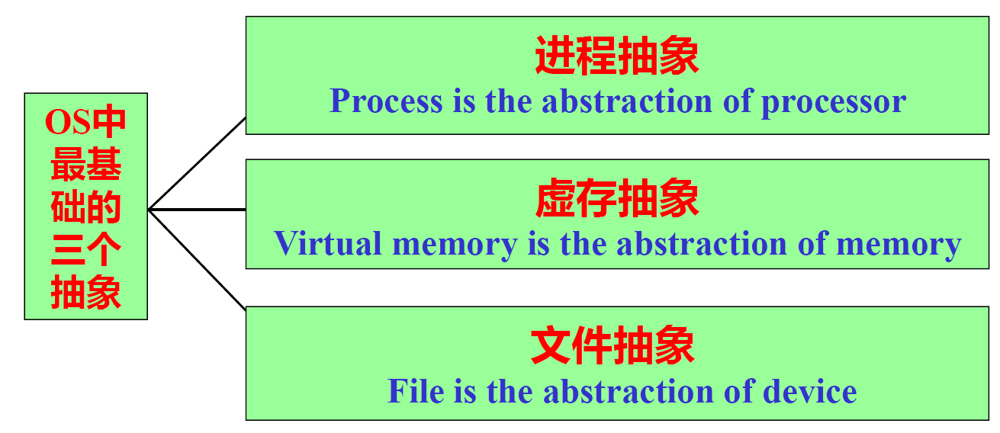
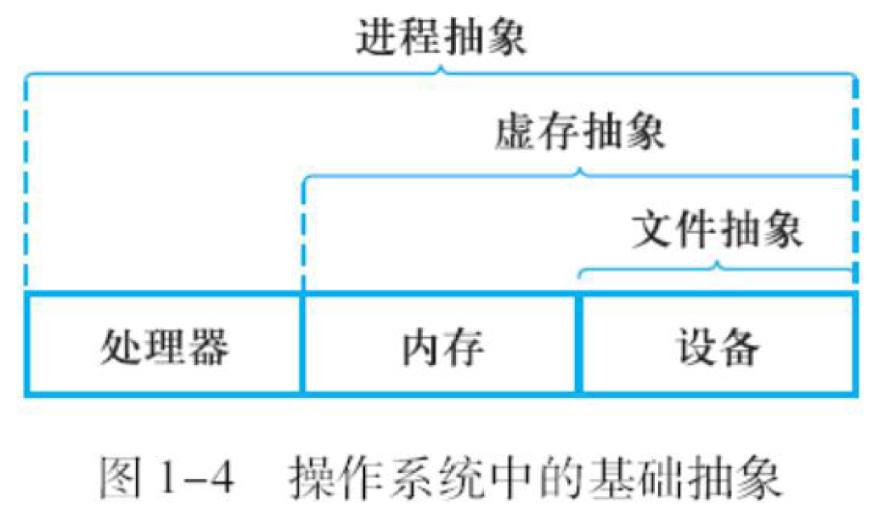
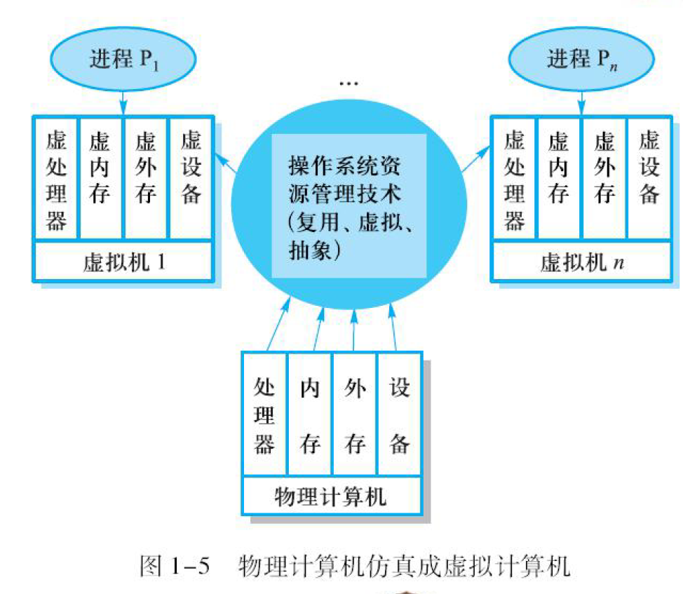
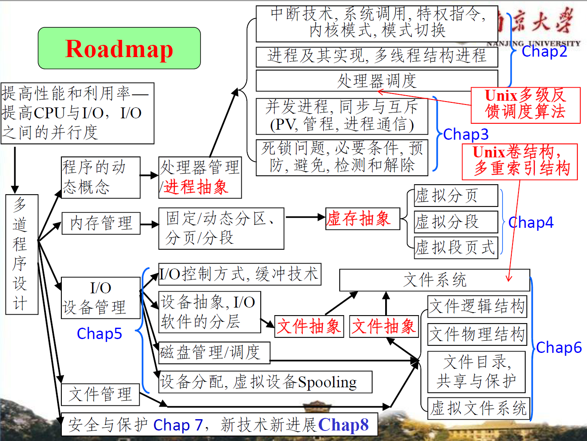

Lecture0-概论
---

<!-- TOC -->

- [1. 操作系统中最基本的抽象](#1-操作系统中最基本的抽象)
- [2. 计算机仿真成虚拟计算机](#2-计算机仿真成虚拟计算机)
- [3. RoadMap](#3-roadmap)

<!-- /TOC -->

# 1. 操作系统中最基本的抽象
1. 进程抽象:对已进入主存正在运行的程序在处理器上操作的状态集的抽象
2. 虚存抽象:是物理内存的抽象，进程可获得一个硕大的连续地址空间来存放可执行程序和数据，可使用虚拟地址来引用物理主存单元。
3. 文件抽象:是对设备(磁盘)的抽象

# 2. 计算机仿真成虚拟计算机

# 3. RoadMap

1. 多道程序设计是一种程序设计的思想
2. 第二章:实现多道程序并发的基础
   1. 特权指令只有在内核态才可以使用
   2. 处理器调度算法
3. 第三章:
   1. 同步和互斥的实现:PV操作方法，通用(对硬件没有要求)且重要
   2. 管程和进程通信的方法
4. 第四章:
   1. 固定、动态分区
   2. 虚存抽象
      1. 内存管理
      2. 虚存管理
      3. 虚拟段页式:通过调度，缺页缺段不会经常出现
5. 第五章:
   1. I/O设备管理
   2. 磁盘设备的调度