Lecture5-文件管理
---
<!-- TOC -->

- [1. 文件系统及其功能](#1-文件系统及其功能)
  - [1.1. 文件系统的概念](#11-文件系统的概念)
  - [1.2. 文件系统中的文件](#12-文件系统中的文件)
  - [1.3. 文件系统的功能](#13-文件系统的功能)
  - [1.4. 文件系统的组成](#14-文件系统的组成)
- [2. 文件](#2-文件)
  - [2.1. 文件的概念与命名](#21-文件的概念与命名)
    - [2.1.1. 文件的概念](#211-文件的概念)
    - [2.1.2. 文件的命名](#212-文件的命名)
    - [2.1.3. 操作系统引入文件系统的优点](#213-操作系统引入文件系统的优点)
  - [2.2. 文化类型和属性](#22-文化类型和属性)
    - [2.2.1. 文件的分类](#221-文件的分类)
    - [2.2.2. 文件属性](#222-文件属性)
    - [2.2.3. 文件属性的内容](#223-文件属性的内容)
    - [2.2.4. 文件属性的例](#224-文件属性的例)
  - [2.3. 文件存取方法](#23-文件存取方法)
    - [2.3.1. 顺序存取](#231-顺序存取)
    - [2.3.2. 直接存取(随机存取)](#232-直接存取随机存取)
    - [2.3.3. 索引存取](#233-索引存取)
- [3. 文件的目录结构](#3-文件的目录结构)
  - [3.1. 文件控制块(File Control Block, FCB)](#31-文件控制块file-control-block-fcb)
  - [3.2. 文件目录](#32-文件目录)
  - [3.3. Linux系统的文件目录建立方法](#33-linux系统的文件目录建立方法)
  - [3.4. 层次目录结构](#34-层次目录结构)
    - [3.4.1. 多级层次结构](#341-多级层次结构)
      - [3.4.1.1. 一级目录结构](#3411-一级目录结构)
      - [3.4.1.2. 二级目录结构](#3412-二级目录结构)
      - [3.4.1.3. 二级目录结构的特点](#3413-二级目录结构的特点)
    - [3.4.2. 树形目录结构](#342-树形目录结构)
      - [3.4.2.1. 不同类型的树形目录结构](#3421-不同类型的树形目录结构)
      - [3.4.2.2. 不同操作系统的目录结构的实现](#3422-不同操作系统的目录结构的实现)
      - [3.4.2.3. 树形目录结构的优点](#3423-树形目录结构的优点)
      - [3.4.2.4. 树形目录结构中的文件定位](#3424-树形目录结构中的文件定位)
  - [3.5. 文件目录的检索](#35-文件目录的检索)
  - [3.6. 活动文件表](#36-活动文件表)
- [4. 文件组织与存储](#4-文件组织与存储)
  - [4.1. 卷和块](#41-卷和块)
  - [4.2. 文件的逻辑结构](#42-文件的逻辑结构)
    - [4.2.1. 逻辑文件](#421-逻辑文件)
    - [4.2.2. 流式文件](#422-流式文件)
    - [4.2.3. 记录式文件](#423-记录式文件)
    - [4.2.4. 记录的成组与分解](#424-记录的成组与分解)
      - [4.2.4.1. 成组与分解的提出](#4241-成组与分解的提出)
      - [4.2.4.2. 成组与分解操作](#4242-成组与分解操作)
      - [4.2.4.3. 成组与分解的特征](#4243-成组与分解的特征)
    - [4.2.5. 记录格式](#425-记录格式)
      - [4.2.5.1. 定长记录](#4251-定长记录)
      - [4.2.5.2. 变长记录](#4252-变长记录)
      - [4.2.5.3. 跨块记录](#4253-跨块记录)
    - [4.2.6. 记录键](#426-记录键)
  - [4.3. 文件的物理结构](#43-文件的物理结构)
    - [4.3.1. 构造文件物理结构](#431-构造文件物理结构)
    - [4.3.2. 顺序文件](#432-顺序文件)
    - [4.3.3. 连接文件](#433-连接文件)
    - [4.3.4. 索引文件](#434-索引文件)
      - [4.3.4.1. 索引文件的访问方式](#4341-索引文件的访问方式)
      - [4.3.4.2. 索引文件的特点](#4342-索引文件的特点)
      - [4.3.4.3. 索引表的组织(重要)](#4343-索引表的组织重要)
    - [4.3.5. 直接文件](#435-直接文件)
- [5. 文件系统功能及实现](#5-文件系统功能及实现)
  - [5.1. 扇区序列划分](#51-扇区序列划分)
    - [5.1.1. 引导块：0号块](#511-引导块0号块)
    - [5.1.2. 超级块：1号块](#512-超级块1号块)
    - [5.1.3. 磁盘inode(索引节点)区：2-(k+1)号块](#513-磁盘inode索引节点区2-k1号块)
    - [5.1.4. 磁盘信息(数据)区：(k+2)块及以后](#514-磁盘信息数据区k2块及以后)
  - [5.2. 文件系统磁盘结构](#52-文件系统磁盘结构)
  - [5.3. 文件相关操作](#53-文件相关操作)
    - [5.3.1. 文件的使用](#531-文件的使用)
    - [5.3.2. 创建文件](#532-创建文件)
    - [5.3.3. 文件的删除](#533-文件的删除)
    - [5.3.4. 文件的打开](#534-文件的打开)
    - [5.3.5. 文件的关闭](#535-文件的关闭)
    - [5.3.6. 读文件](#536-读文件)
    - [5.3.7. 写文件](#537-写文件)
    - [5.3.8. 文件的随机存取](#538-文件的随机存取)
- [6. 文件目录的管理](#6-文件目录的管理)
- [7. 文件共享](#7-文件共享)
  - [7.1. 静态共享](#71-静态共享)
  - [7.2. 动态共享](#72-动态共享)
    - [7.2.1. 使用同一位移指针的文件共享](#721-使用同一位移指针的文件共享)
    - [7.2.2. 使用不同位移指针的文件共享](#722-使用不同位移指针的文件共享)
    - [7.2.3. 两种方式存在的问题](#723-两种方式存在的问题)
    - [7.2.4. 两种方式的实现](#724-两种方式的实现)
  - [7.3. 符号链接共享](#73-符号链接共享)
    - [7.3.1. 硬链接](#731-硬链接)
    - [7.3.2. 软连接(符号链接)](#732-软连接符号链接)
- [8. 文件空间管理](#8-文件空间管理)
  - [8.1. 位示图](#81-位示图)
  - [8.2. 空闲区表](#82-空闲区表)
  - [8.3. 空闲块链](#83-空闲块链)
  - [8.4. 补充：空闲块列表](#84-补充空闲块列表)
  - [8.5. 补充：成组空闲块链](#85-补充成组空闲块链)
- [9. 文件的安全与保护](#9-文件的安全与保护)
  - [9.1. 文件的安全](#91-文件的安全)
    - [9.1.1. 文件共享](#911-文件共享)
    - [9.1.2. 文件共享的并发控制](#912-文件共享的并发控制)
    - [9.1.3. 文件的保密措施](#913-文件的保密措施)
  - [9.2. 文件的保护](#92-文件的保护)
    - [9.2.1. 文件的副本](#921-文件的副本)
      - [9.2.1.1. 动态多副本](#9211-动态多副本)
      - [9.2.1.2. 文件转储](#9212-文件转储)
    - [9.2.2. 文件的存取控制矩阵](#922-文件的存取控制矩阵)
    - [9.2.3. 存取控制表](#923-存取控制表)
    - [9.2.4. 基于存取控制矩阵/表的文件保护](#924-基于存取控制矩阵表的文件保护)
- [10. 补充：内存映射文件](#10-补充内存映射文件)
- [11. 补充：文件系统的性能与可靠性](#11-补充文件系统的性能与可靠性)
  - [11.1. 文件系统性能问题措施](#111-文件系统性能问题措施)
  - [11.2. 提高文件可靠性措施](#112-提高文件可靠性措施)
  - [11.3. 文件系统一致性检查](#113-文件系统一致性检查)
- [12. 文件系统的实现层次](#12-文件系统的实现层次)

<!-- /TOC -->

# 1. 文件系统及其功能

## 1.1. 文件系统的概念
1. 通常把文件与管理信息资源的管理程序的集合，是操作系统中负责存取和管理信息资源的模块，采用统一方法管理用户信息和系统信息的存储、检索、更新、共享和保护，并为用户提供一整套行之有效的文件使用及操作系统。

## 1.2. 文件系统中的文件
1. 文件这一术语不但反映了用户概念中的**逻辑结构**，而且和存放它的辅助存储器(也称文件存储器)的**存储结构**紧密相关
2. 所以，同一个文件必须从**逻辑文件**和**物理文件**两个侧面来观察它
   1. 对于用户，需要并遵守**文件系统的规则**来定义文件信息的逻辑结构，由文件系统提供**按名存取**方式来实现对文件信息的存储和检索。
   2. 对于系统，必须采用**特定数据结构和有效算法**实现文件的**逻辑结构到存储结构**的映射，实现对文件存储空间和文件信息的管理，提供多种存取方法。

## 1.3. 文件系统的功能
1. 文件系统面向用户的功能是：
   1. 文件的按名存取
   2. 文件的共享、保护和加密
   3. 文件的操作和使用(文件的查找和定位)
2. 为了实现这些功能，OS必须考虑：
   1. 文件目录的建立和维护
   2. 实现从逻辑文件到物理文件的转换
   3. 存储空间的分配和回收
   4. 数据的保密和保护
   5. 监督用户存取和修改文件的权限
   6. 提供文件的存取方法和文件存储结构
   7. 提供给一组易用的文件操作和命令
   8. 提供与设备管理交互的统一接口。

## 1.4. 文件系统的组成
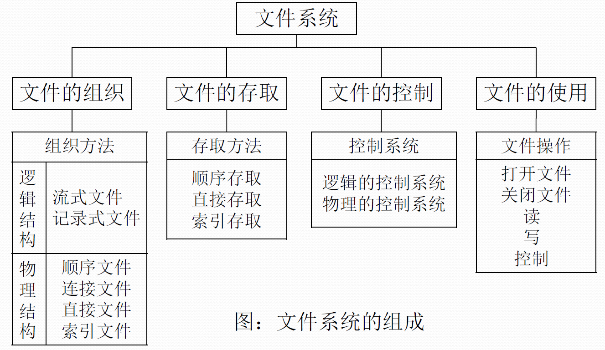

# 2. 文件

## 2.1. 文件的概念与命名

### 2.1.1. 文件的概念
1. **文件**是由新消息按一定结构组成，可持久化保存的抽象机制，由于它必定存储在某种设备上，故也可以认为文件是设备的一种抽象。
2. **文件**由文件名标识，用户通过文件名就可以对文件进行访问。
3. **文件**(document)与**计算机文件**(file)

### 2.1.2. 文件的命名
1. 文件名是字母、数字或其他符号组成的字母数字串，其格式和长度因系统而异。
2. 文件命名一般包括**文件名和扩展名**。
3. 前者用于识别文件，后者用于标识文件特性，两者之间用`.`隔开。
4. 每个OS都有约定的扩展名，Windows中：
   1. `.COM`表示可执行的二进制代码文件
   2. `.EXE`表示可执行的浮动二进制代码文件
   3. `.LIB`表示库程序文件
   4. `.BAT`表示批命令文件
   5. `.OBJ`表示编译或汇编生成的目标文件
5. UNIX的约定文件名，请大家自己阅读

### 2.1.3. 操作系统引入文件系统的优点
1. **用户使用方便**，使用者无需记住信息存放在辅助存储器(外存)中的物理位置，也无需考虑如何将信息存放到存储介质上，只要知道文件名，给出有关操作系统要求便可存取信息，实现了"按名存取"
2. **文件安全可靠**，由于用户通过文件系统才能实现对文件的访问，而文件系统能提供各种**安全、保密和保护**措施，故可防止对文件信息的有意或无意的破坏或窃用
3. **系统能有效地利用存储空间(文件可备份)**，优化安排不同属主的文件的位置，如果文件使用过程中出现设备故障，系统组织重执或恢复，对因硬件失效而可能造成的信息破坏可组织转储以加强可靠性。
4. **文件可共享**，文件系统还能提供文件的共享功能，如不同的用户可以使用同名或异名的同一文件，提高了文件和文件空间的利用率
5. 总之，把数据组织成文件形式加以管理和控制是计算机数据管理的重大进展

## 2.2. 文化类型和属性

### 2.2.1. 文件的分类
1. 按**用途**可分成：系统文件、库文件、用户文件
2. 按**保护级别**可分成：只读文件、读写文件、不保护文件
3. 按**信息时限**可分成：临时文件、永久文件、档案文件
4. 按**设备类型**可分成：磁盘文件、磁带文件、光盘文件、软盘文件
5. 还可以按文件的**逻辑结构或物理结构**分类
6. Linux系统支持文件：普通文件、目录文件、特殊文件(外部设备文件，可分为块设备文件和字符设备文件)

### 2.2.2. 文件属性
1. 文件属性是指操作系统为文件配置的控制和管理信息，目的是为了方便和用户对文件的管理、保护和使用。

### 2.2.3. 文件属性的内容
1. 文件基本属性：文件名和扩展名、文件属主ID，文件所属组ID等
2. 文件类型属性：普通文件等
3. 文件保护属性：规定谁可以访问，以何种方式访问，常见的文件访问方式有读、写、执行、更新、删除等，有的系统还为文件设置口令保护。
4. 文件管理属性：如创建时间、最后访问时间、最后修改时间等。
5. 文件控制属性：
   1. 文件逻辑结构信息，如记录键、记录类型、记录个数、记录长度、成组因子数等。
   2. 文件物理结构信息，如文件所在设备名、物理设备类型、记录存放的盘块号或文件信息首块盘块号。
6. 存取控制表的一种简化方法是用户分类，再针对**每类**用户规定文件属性。

### 2.2.4. 文件属性的例
|          | 读  | 写  | 执行 |
| -------- | --- | --- | ---- |
| 文件主   | 1   | 1   | 0    |
| 伙伴     | 1   | 0   | 0    |
| 其他用户 | 1   | 0   | 0    |

1. chmod命令可以改变文件属性
2. chown命令用于变更文件属主
3. chgrp命令用于变更用户伙伴

## 2.3. 文件存取方法
1. 文件存取方法是操作系统为用户程序提供的使用文件的技术和手段(读写文件存储器上的物理记录的方法)
2. 文件存取方法在某种程度上依赖于**文件的物理结构**
3. 文件系统应该尽可能提供多种存储方法，比如索引文件可以模拟顺序存取、一定程度上的直接存取

### 2.3.1. 顺序存取
1. 按**记录顺序**进行读/写操作的存取方法称**顺序存取**
2. 过程：
   1. 读操作根据**读指针**读出当前记录，同时推进读指针，指向下一次要读出的记录
   2. 写操作则设置**写指针**，把一个记录写到文件未端， 同时推进写指针
3. 允许对读指针进行前跳或后退n(整数)个记录的操作(允许对固定长度记录的顺序文件采用随机访问)
4. 顺序访问主要用于磁带文件，也适用于磁盘上的顺序文件。
5. 顺序存存取设备
   1. 顺序存取设备是严格依赖信息的物理位置次序进行定位和读写的存储设备
   2. **磁带机**是最常用的一种顺序存取存储设备，它具有存储容量大、稳定可靠、卷可装卸和便于保存等优点，广泛用作存档
   3. 磁带的一个**突出特点**是**块长的变化范围较大**，块可以很小，也可以很大，原则上没有限制
   4. **光盘**也是一种顺序存取存储设备，光盘上的**磁道不是同心圆，而是螺旋形的，本质的线性的。**

### 2.3.2. 直接存取(随机存取)
1. 可以非顺序地从文件中的任何位置存取文件内容。
2. 很多应用场合要求快速地以**任意次序**直接**读写**某个记录，例如，航空订票系统，用航班号作标识，把特定航班的所有信息存放在物理块中，用户预订某航班时，直接计算出该航班的存位置
3. 常用于磁盘文件。
4. 直接存取设备
   1. 盘是一种直接存取存储设备，又叫**随机存取存储设备**
   2. **移臂与旋转**两维组织，存取速度高
   3. 它的每个物理记录有确定的位置和唯一的地址，存取任何一个物理块所需的时间几乎不依赖于此信息的位置

### 2.3.3. 索引存取
1. 基于**索引文件**的索引存取方法
2. 文件的记录不按位置而是按其记录名和记录键来编址，所以用户提供记录名或记录键之后，先按名查找，在查找需要的记录。
   1. 采用记录键时，往往按照一种次序如字母序进行顺序存放
   2. 除可采用按键存取外，也可以采用顺序存取或直接存取的方法
3. 实际的系统中，大都采用多级索引，以**加速记录**查找过程

# 3. 文件的目录结构
1. 文件系统往往采用分层结构实现，大概分为文件管理、目录管理和磁盘管理三层。
   1. 文件管理实现文件逻辑结构，为用户提供各种文件系统调用及文件访问权限的设置工作。
   2. 目录管理负责查找文件描述符，进而找到需要访问的文件，并进行访问权限检查等工作，还需要完成目录的添加、删除、重排等操作
   3. 磁盘管理除管理文件空间外，还将文件的逻辑地址转换为磁盘的物理地址，即由逻辑块号找到柱面号、磁头号与扇区号，设备与内存之间的数据传输操作由文件系统调用设备管理实现。
2. 文件的目录结构中往往是具有双向索引结构的，如下图

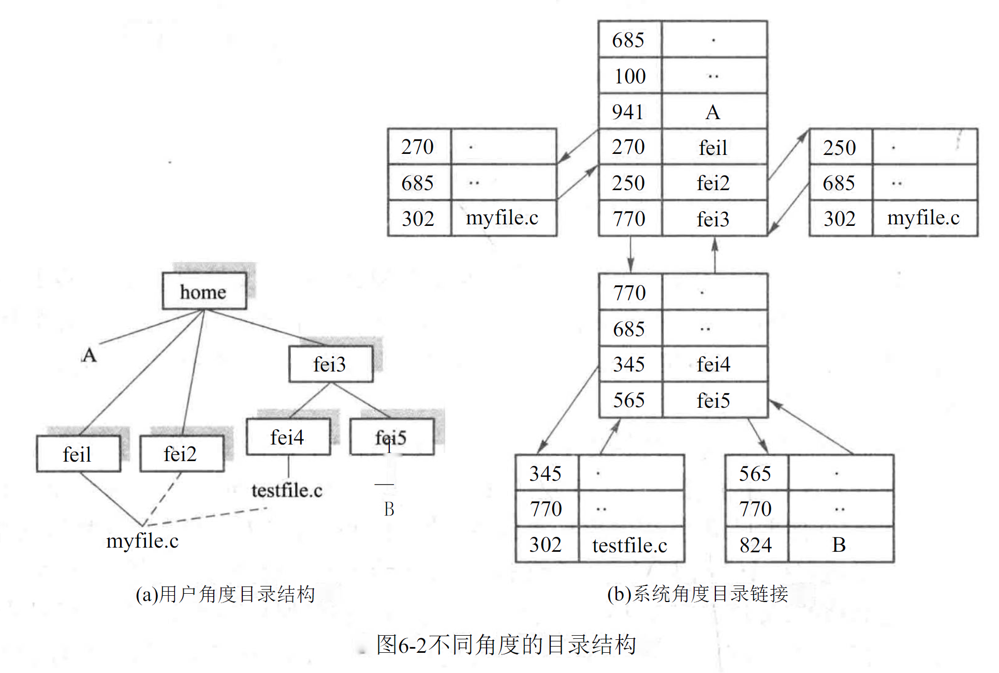

## 3.1. 文件控制块(File Control Block, FCB)
1. 文件控制块是操作系统为每个文件建立的唯一数据结构，包含了全部的文件属性。
2. 目的是为方便操作系统对文件的管理、控制和存取。
3. 文件由FCB和文件体组成，创建文件时，系统要同时创建FCB。

## 3.2. 文件目录
1. 文件目录是实现文件的**按名存取**的关键数据结构，目录结构一般是层次性的、非线性的，多维坐标可以通过一定方式降成一维坐标。
2. 文件目录需要永久保存，因此也组织成文件存放在磁盘上，称**目录文件**
   1. 需要时调入内存。
   2. 目录文件永不为空，至少包含当前目录`.`和父目录`..`
3. 为了加快文件查找速度，通常将**FCB汇集和组织**在一起形成文件目录，文件目录包含许多目录项，目录项分为两种，分别描述子目录和描述文件。
4. 文件系统的基本功能之一就是负责文件目录的建立、维护和检索，要求编排的目录**便于查找、防止冲突**

## 3.3. Linux系统的文件目录建立方法
1. FCB中的**文件名和其他管理信息**分开，其他信息单独组成一个**数据结构**，成为索引节点inode，此节点的位置由inode号标识。


2. 这样目录项就仅剩下了文件名和inode号，称为**基本目录项**，一个磁盘块就可以放置更多的基本目录项
3. inode被集中存放在磁盘的inode区，和目录去是分割开的，按名存储是根据目录块进行的。
   1. inode允许一个文件可以被多次访问。
   2. inode不应该过多，类比图书馆卡片。
4. 能够减少索引文件所需访问的磁盘物理块数。
5. VFS的inode的部分内容

```c++
struct inode {
   unsigned long i_ino;                   /* inode 号 */
   atomic_t i_counl;                      /* inode 引用数 */
   kdev_t i_dev;                          /* inode所在设备*/
   loff_t i_size;                         /* inode所在设备*/
   nlink_t i_nlink;                       /* inode所在设备*/
   unsigned long i_blksize;               /* inode所在设备*/
   unsigned long i_block;                 /* inode所在设备*/
   struct inode_operations * i_op;        /* inode所在设备*/
   ...
   union {
      struct minix_inode_info minix_i;
      struct ext2_inode_infb ext2_i;
      ...
   }
}
```

6. 由于磁盘inode记录文件的属性和相关信息，会被频繁访问，我们在内存区开辟内存索引节点表，又称活动inode表，含100个表项，每个表项称为一个活动inode
   1. 磁盘inode反应文件静态特性。
   2. 活动inode反应文件动态特性。
7. 嵌入在inode中的**索引地址表**不可以太大，不然对于一个大文件而言，就会比较大，根据下面公式我们可以发现inode区相同情况下放置的inode号就会变少，导致可能陷入磁盘还有物理空间，但是没有inode号可以使用的尴尬境地。
   1. 文件较小使用直接地址(直接索引)
   2. 文件较大使用间接索引

$$
total_{inode} = \frac{inode区容量}{inode尺寸(尽量小)}
$$

## 3.4. 层次目录结构
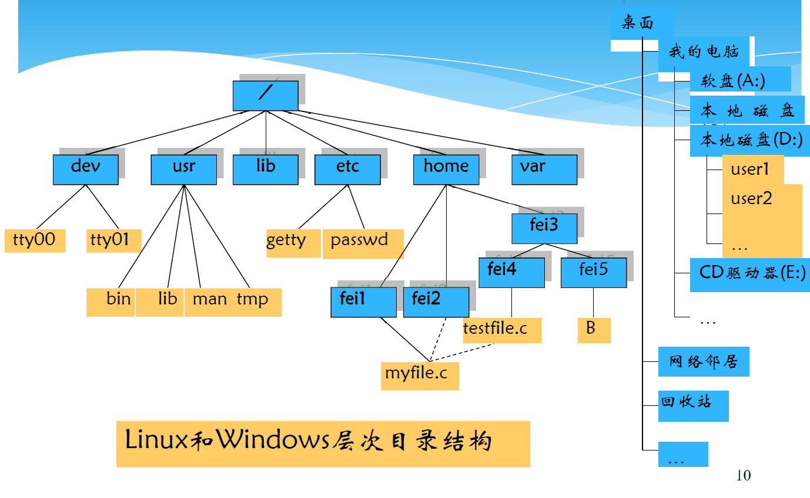

### 3.4.1. 多级层次结构

#### 3.4.1.1. 一级目录结构
1. 一级目录结构：在操作系统中构造**一张**线性表，与每个文件的相关属性占用一个目录项，构成了一级目录结构
2. 缺点：文件重名和文件共享。

#### 3.4.1.2. 二级目录结构
1. 第一级为主文件目录，它用于管理**所有用户文件目录**，它的目录项登记了系统接受的用户的名字及该用户文件目录的地址
2. 第二级为用户的文件目录，它为该用户的每个文件保存一个登记栏，其内容与一级目录的目录项相同
3. 每一用户只允许查看自己的文件目录

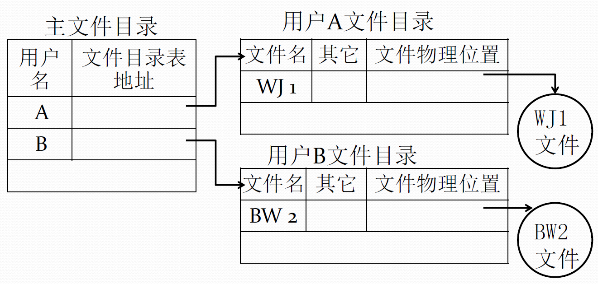

#### 3.4.1.3. 二级目录结构的特点
1. 采用二级目录管理文件时，因为任何文件的存取都通过**主文件目录**，于是可以检查访问文件者的**存取权限**，避免一个用户未经授权就存取另一个用户的文件，使用户文件的**私有性**得到保证，实现了对文件的保密和保护
2. 特别是不同用户具有同名文件时，由于各自有不同的用户文件目录而不会导致混乱
3. 对于同一个用户而言，同样存在文件多、容易重名问题

### 3.4.2. 树形目录结构
1. 每一级目录可以登记下一级目录，也可以登记文件，从而，形成了**层次文件目录结构**
2. 层次目录结构通常采用**树形目录结构**，它是一棵倒向的有根树，树根是根目录；
   1. 从根向下，每一个树分叉(树枝)是一个子目录
   2. 树叶是文件
3. 一个文件的全名包括从根目录起到文件为止，在通路上遇到的所有子目录路径，各字目录名之间用斜线分隔开，子目录名所组成的部分称为**路径名**。

#### 3.4.2.1. 不同类型的树形目录结构
1. **纯树型目录结构**：每个文件都只有一个父目录，缺点：文件的共享不是对称的，其他授权用户必须通过属主目录才能访问文件。
2. **有向无环图**则允许文件有多个父目录，破坏了树特性，但是不同用户可以用对称的方式实现文件共享，即可能属于不同用户的多个目录使用不同的文件名访问和共享同一个文件，维护复杂，需要维护文件的引用计数(用于文件删除)

#### 3.4.2.2. 不同操作系统的目录结构的实现
1. Linux支持多父目录
   1. 主父目录是文件拥有者，文件存放在该目录下。
   2. 次父目录通过link方式来链接和引用。
   3. 下图中便示例这种文件共享的情形，文件/home/fei1为myfile.c的主父目录(图中实线表示)，/home/fei2和/home/fei3/fei4均为文件myfile.c的次父目录(图中虚线表示)。


1. Windows实现被称作"快捷方式"的多父目录连结，快捷方式是一些指向不同文件夹(子目录)和菜单之间任意复制和移动的文件及文件夹的指针，删除快捷方式就是删除指针。

#### 3.4.2.3. 树形目录结构的优点
1. 较好地反映现实世界中具有**层次关系**的数据集合和较确切地反映系统内部文件的组织结构
2. 不同文件可以重名，只要它们不位于**同一末端的子目录**中
3. 易于规定不同层次或子树中文件的不同存取权限，便于文件的保护、保密和共享

#### 3.4.2.4. 树形目录结构中的文件定位
1. 在树形目录结构中，一个文件的全名包括从根目录开始到文件为止，通路上遇到的所有子目录路径，又称为路径名
2. 各子目录名之间用正斜线`/`(反斜线`\`)隔开
3. 一个硬盘分区可以组织成一颗子树
   1. 每棵子树可以对应于一个逻辑盘符(Win)：最多有26个逻辑盘符
   2. 也可以把众多子树嫁接成一颗大树(UNIX)

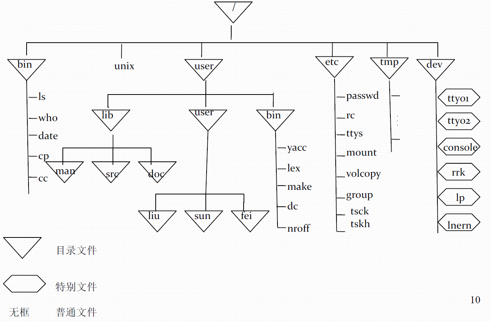

## 3.5. 文件目录的检索


1. 每个目录在创建时都自动含有两个特殊目录项
   1. `.`:目录自身的inode的入口
   2. `..`:父目录的inode的入口
2. 绝对路径与相对路径
   1. 绝对路径是从根目录开始往下进行推导。
   2. 相对路径是从当前目录开始往下进行推导。
3. 假设应用进程要打开文件/home/feil/myfile.c，文件系统开始搜索
   1. 首先，遇到根目录"/"，它通常被存放在磁盘的固定盘块中，根据活动inode表中根目录的活动inode，把它作为当前工作索引节点并将其第一个物理块读入内存缓冲区
   2. 接着读入路径的第一个分量字符串home；文件系统对根目录的内容进行搜索，若找不到，则依次读入第二、第三个物理块，...，进行比较，直至找到home的inode号
   3. 检查活动inode表
      1. 若找不到home的inode，为其分配一个活动inode,由于每个inode位于磁盘上已分配好的固定位置，可从磁盘home的inoe中装人其内容；
      2. 否则，直接查找home的活动inode，通过属性查明home为子目录，经核对符合访问权限，把它作为当前工作索引节点，读人路径的第二个分量字符串feil，子目录home对应的inode为685,从目录文件第一个物理块中可找到子目录feil的inode为270
   4. 类似地读入子目录feil目录文件的物理块便能找到myfile.c的inode号为302;文件系统为此文件在活动inode表中分配一个活动inode , 从myfile.c的磁盘inode中装入内容。中间任何一步出错都会返回错误码，由于路径名分析完毕，这时修改活动inode的有关内容，打开文件目录的查找操作到此结束。
4. 现代操作系统都配置了更改工作目录的命令。
5. 目录项查找
   1. 顺序查找法：一次扫描
   2. 二分查找法：目录表项是按键顺序编排
   3. 杂凑法：把每个文件名经过变换函数变为唯一的目录表项。

## 3.6. 活动文件表
1. 系统可以为每个用户进程建立一张活动文件表，当用户使用一个文件之前，先通过"打开"操作，把该文件有关目录信息复制到指定主存区域，有关信息填入活动文件表，以建立用户进程和该文件索引的联系
2. 当不再使用该文件时，使用"关闭"，切断用户进程和这个文件的联系，同时，若该目录已被修改过，则应更新辅存中对应的文件目录

# 4. 文件组织与存储

## 4.1. 卷和块
1. 文件存储介质有磁带、光盘和磁盘
2. **卷**是存储介质的物理单位，对应于一盘磁带、一块软盘、一个光盘片、一个硬盘分区
3. **块**是存储介质上连续信息所组成的一个区域，也叫做**物理记录**
   1. 块在主存储器和辅助存储器进行信息交换的**物理单位**，每次总是交换一块或整数块信息
   2. 决定块的大小要考虑**用户使用方式、数据传输效率和存储设备类型**等多种因素
   3. 不同类型的存储介质，块的长短常常各不相同；对同一类型的存储介质，块的大小一般相同，但也可以不同
4. 外围设备由于**启停机械动作或识别不同块**的要求，两个相邻块之间必须留有间隙，间隙是块之间不记录用户代码信息的区域

## 4.2. 文件的逻辑结构

### 4.2.1. 逻辑文件
1. 独立于**物理环境**的，用户概念中的**抽象信息组织方式**是**文件的逻辑结构**
2. 用户能观察到的，并加以处理的数据集合构成逻辑文件
3. 文件的逻辑结构分为两种形式
   1. 一种是**流式文件**
   2. 一种是**记录式文件**

### 4.2.2. 流式文件
1. **流式文件**是**无结构**文件，指文件内的数据不再组成记录，只是由一串依次的**字节**组成的**信息流序列**，称为**字节流文件**。
2. 这种文件常常按长度来读取所需信息，也可以用插入的特殊字符作为分界，使用读写指针访问
3. 大多数现代操作系统比如Linux系统只提供流式文件。

### 4.2.3. 记录式文件
1. 记录式文件是一种**有结构**的文件，它是若干**逻辑记录信息**所组成的记录流文件
   1. 逻辑记录是文件中按**信息**在**逻辑**上的**独立含义**所划分的信息单位
   2. 每个职工的工资信息是一个**逻辑记录**；
   3. 整个单位职工的工资信息便组成了该单位工资信息的**记录式文件**
2. 逻辑记录是文件内**独立的最小信息单位**，文件记录位置代替字节位置。
3. 记录是文件常用的记录组织和使用方法
   1. 记录式顺序文件：文件的记录顺序生成并被顺序访问。
   2. 记录式索引文件：文件使用索引表，表项包含记录键和索引指针，记录键由应用程序确定，而索引文件便指向相应记录。

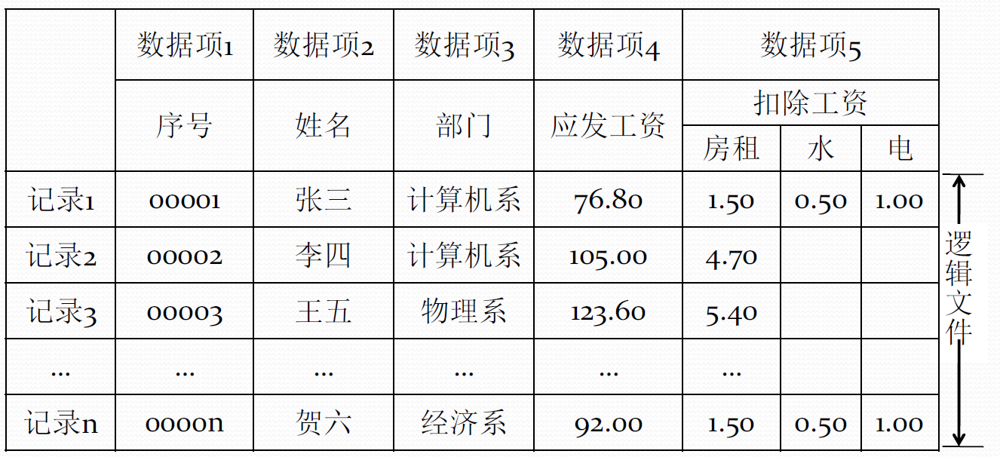

4. 记录式文件与数据库
   1. 数据库管理系统也支持逻辑记录
   2. 但数据库有别于记录式文件，数据库中的记录之间可以通过数据冗余构成某种联系
   3. 数据库管理系统支持基于联系的数据查询，文件系统则不行

### 4.2.4. 记录的成组与分解

#### 4.2.4.1. 成组与分解的提出
1. 逻辑记录是按信息在逻辑上的**独立含义**由用户所划分的**单位**。
2. 块是系统划分的存储介质上连续信息所组成的区域。
   1. 一条逻辑记录被存放到文件存储器的存储介质上时可能占用一个或多块，或者一个物理块包含多条逻辑记录。
   2. 扇区也叫做物理块，或者物理记录
3. 组：若干逻辑记录的组合。
4. 块因子：每块中逻辑记录的个数。比如物理块800K，卡片80K，此时的块因子数就是10。
5. 对于流式文件，一个物理记录可以存放很多个连续字节。

#### 4.2.4.2. 成组与分解操作
1. 系统设置独立于用户数据区的**输入/输出缓冲区**
2. **记录的成组操作**：在**输出缓冲区**内进行，凑满一块后才将缓冲区内的信息写到存储介质上
3. **记录的分解操作**：当存储介质上的一个物理记录读进输入缓冲区后，把逻辑记录从块中分离出来的操作

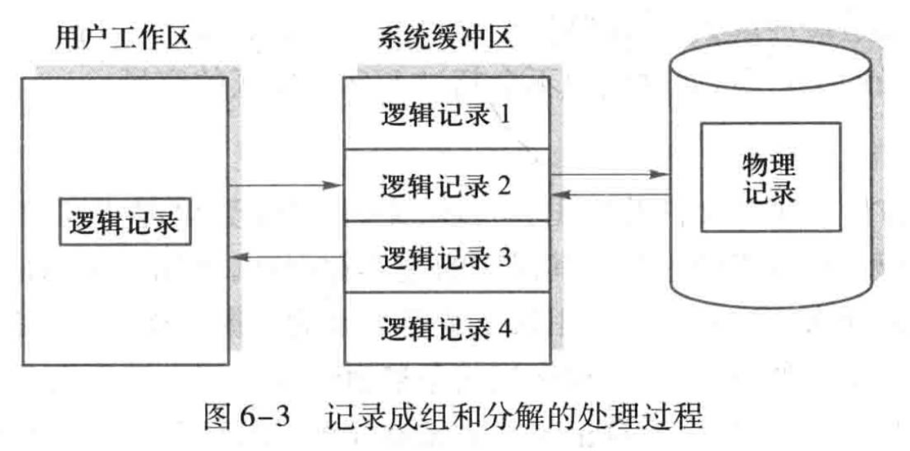

#### 4.2.4.3. 成组与分解的特征
1. 优点：记录成组与分解不仅**节省存储空间**，还能**减少输入输出操作次数**，提高系统效率
2. 记录成组与分解处理带来的新特征：
   1. **提前读**：用户读请求，导致包含该逻辑记录的**物理块**读入输入缓冲区；这一操作可能读入了多个逻辑记录，可以更快的访问附近的记录。
   2. **推迟写**：用户写请求，首先是写入输出缓冲区，只有当该缓冲区中的逻辑记录满后才会引起实际输出。
3. 副作用(推迟写操作)：因为优先写到输出缓冲区，等到缓冲区满，才会写到磁盘，可能会造成**数据不一致**(写到缓冲区，但是因为**停电**等原因没有办法同步到磁盘)

### 4.2.5. 记录格式
1. 逻辑记录的长度：一条逻辑记录中所有数据项长度的总和。
2. 记录格式：记录内数据的排列方式。
3. 记录式文件中，记录长度取决于应用程序的需要，记录格式有
   1. 定长记录
   2. 变长记录
   3. 跨块记录

#### 4.2.5.1. 定长记录
1. 记录式文件中所有的逻辑记录具有相同长度，同时所有数据项的相对位置也是固定的。
2. 处理方便，易于控制：成组除了最后一块，块内逻辑记录个数相同。
   
#### 4.2.5.2. 变长记录
1. 记录式文件中所有的逻辑记录长度不相等，但每条逻辑记录长度处理前能预先确定。逻辑记录中的第一个字段指明单个变长逻辑记录的字节数，第二个字段存放记录信息。
2. 导致变长记录的情况
   1. 包含一个或多个可变长度的数据项。
   2. 包括可变数量的定长数据项。
3. 处理复杂，但是节省存储空间。

#### 4.2.5.3. 跨块记录
1. 逻辑记录长度大于块大小，不需要记录块长度，文件系统自动 分割和装配跨块逻辑记录的信息段。
2. 分割存储，读出装配、
3. 适用于在不同物理特性的设备类型之间传输时。

### 4.2.6. 记录键
1. 记录键：用于标识**某条逻辑记录**的数据项，叫关键字，简称键。
2. 在同一个文件中，能够唯一表示某条逻辑记录的记录键称为主键。
3. 主键是最重要的，但是并不一定唯一。

## 4.3. 文件的物理结构
1. 文件的物理结构和组织是指**逻辑文件在物理存储空间中的存放方法和组织关系**
   1. 此时文件看做物理文件，即相关物理块的集合。
   2. 文件的存储结构涉及**块的划分、记录的排列、索引的组织、信息的搜索**等许多问题
2. **文件存储结构的优劣**直接影响文件系统的性能

### 4.3.1. 构造文件物理结构
1. 计算法：
   1. 设计映射算法，通常有线性计算法、杂凑法等，通过对记录键进行计算转换成对应的物理地址，从而找到所需记录。
   2. 直接寻址文件、计算寻址文件和顺序文件均属于此类。
   3. 存取效率高，不必增加存储空间存放附加控制信息。
2. 指针法：
   1. 设置专门指针，指明相应记录的物理地址或表达各记录之间的关联。
   2. 索引文件、索引顺序文件、连接文件均属于此类。
   3. 可以将文件信息的逻辑次序与在存储介质上的物理块排列次序完全分开，便于随机存储，便于更新，但是消耗存储空间。

### 4.3.2. 顺序文件
1. 将一个文件中**逻辑上连续**的信息存放到**存储介质的依次相邻的块**中便形成顺序结构，这类文件叫**顺序文件**，又称**连续文件**
2. FCB保存第一个物理块地址和总块数。
3. 磁带文件、光盘文件是典型例子，批处理文件，系统文件用得最多
4. 顺序文件的特点：
   1. 优点：顺序存取记录时速度快
   2. 缺点：建立文件前需要预先知道文件长度，修改、插入和添加文件记录困难，变长记录处理困难，空闲块的浪费。

### 4.3.3. 连接文件


1. 使用连接字(指针)来表示文件中各条记录之间的关系。
2. 连接文件，又称串联文件，输入井、输出井都是此类文件。
3. 连接文件的特点
   1. 优点：易于对文件记录做**增、删、改**，易于动态增长记录；不必预先确知文件长度；存储空间利用率高
   2. 缺点：存放指针需**额外的存储空间**；由于存取须通过缓冲区，待获得连接字后，才能找到下一物理块的地址，因而，仅适用于顺序存取

### 4.3.4. 索引文件
1. 索引文件为每个文件建立了一张**索引表**，索引表记录方式有多种：
   1. 记录组成文件的磁盘块号，适用于流式文件。
   2. 所以表项包含记录键及其磁盘块号，适用于记录式文件。

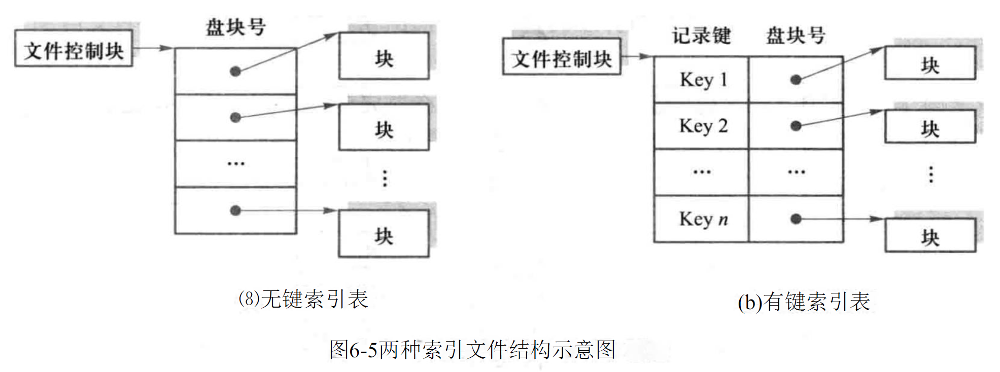

2. **索引文件**：利用索引表来搜索记录的文件。
3. **索引表**可存放在FCB文件中，记录可以散列存储。
4. 适用于数据记录保存在磁盘上的文件。

#### 4.3.4.1. 索引文件的访问方式
1. 索引文件在文件存储器上分两个区：**索引区和数据区**
2. 访问索引文件需两步操作
   1. 第一步查找索引表
   2. 第二步获得记录物理地址
3. 需要两次访问辅助存储器，若文件索引已预先调入主存储器，那么，就可减少一次内外存信息交换

#### 4.3.4.2. 索引文件的特点
1. **索引结构**可以被认为是**连接结构的一种扩展**，除了具备连接文件的优点外，还克服了它只能作顺序存取的缺点，具有直接读写任意一个记录的能力，便于文件的增、删、改
2. **索引顺序文件**是**顺序文件**的一种扩展
3. 索引文件的**缺点**是：增加了索引表的**空间开销和查找时间**

#### 4.3.4.3. 索引表的组织(重要)
1. 一级索引：存放的是物理地址
2. 两级索引：若干索引本身也是一种记录。
3. 多级索引：以三级索引为例，一个地址指引$128^3$个地址，但是全部使用三级索引也不行，性能会比较差，所以我们往往选择使用混编的方式。
4. 动态扩容：放不下就扩容

| 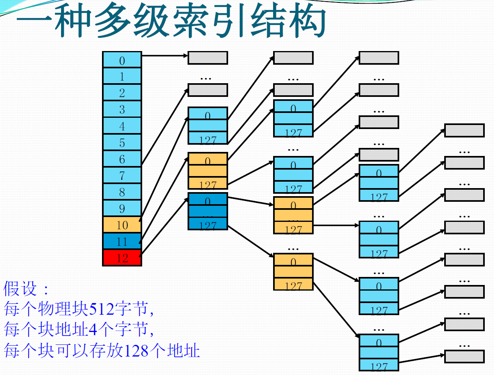 | 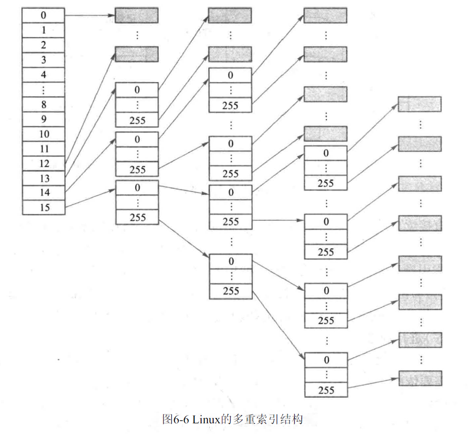 |
| ------------------- | -------------------- |

5. inode规定了15个索引项，每项4KB
   1. 直接索引：前12项存放文件信息的磁盘块号
   2. 一次间接索引：第13项指向一个物理块
   3. 二次间接索引：第14项指向一个物理块
   4. 三次间接索引：第15项指向一个物理块
   5. ext2中，每个物理块存放1024B，所以上面右图最多存放$12KB + 256KB + 256^2KB+256^3KB$
6. 长度不超过12个磁盘块的占80%，只有超过12个磁盘块才使用简介索引。
7. 多级索引例子(重要)：注意是从0-128一共129项

| 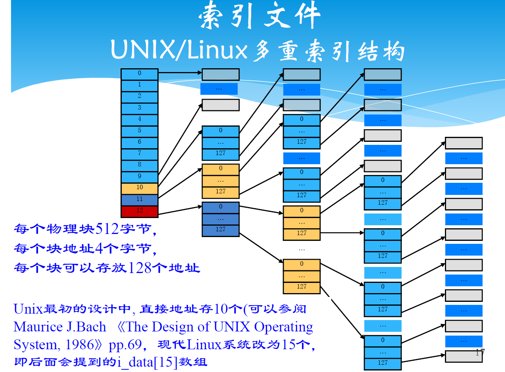 | 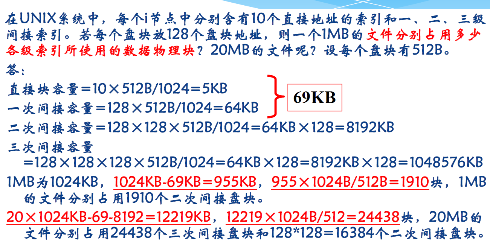 |
| -------------------- | -------------------- |


### 4.3.5. 直接文件
1. **直接文件、散列文件或哈希文件**：在直接存取存储设备上，利用哈希法将记录的关键字与其地址之间建立某种对应关系，以便实现快速存取的文件
2. 在Linux系统中，常用哈希法实现cache。
3. 计算寻址结构可能出现"冲突"，即不同的关键字可能变换出**相同的地址**来，解决办法是溢出处理技术，包含有**链表法、循环探查法、二次散列法、溢出区法**等
4. 访问过程：
   1. 构造哈希函数：得到哈希后块号A
   2. 建立目录文件，将记录放置到对应的块A中
   3. 查找文件：根据文件名，计算出A，然后加载物理块，在物理块中遍历找到对应文件。
   4. 溢出处理：结合溢出处理技术。

# 5. 文件系统功能及实现
1. 文件系统向应用程序提供了一组系统调用，包括建立、打开、关闭、撤销、读/写和控制，通过这些系统调用，用户能够获得文件系统的各种服务。
2. 系统会为每一个用户进程建立一张**打开文件表**
   1. 用户使用文件之前先通过**打开**操作，将文件FCB拷贝到指定内存位置
   2. 当不在使用时，通过**关闭**操作切断和文件的联系，释放文件的FCB。
3. 接下来以Linux系统为例，介绍其文件系统调用的种类、功能和实现。内核将磁盘作为主要文件存储器，磁盘按扇区编号，扇区序列分成三个部分。
4. 文件系统内部结构如下图所示：不是三级坐标，是经过转化后的结构

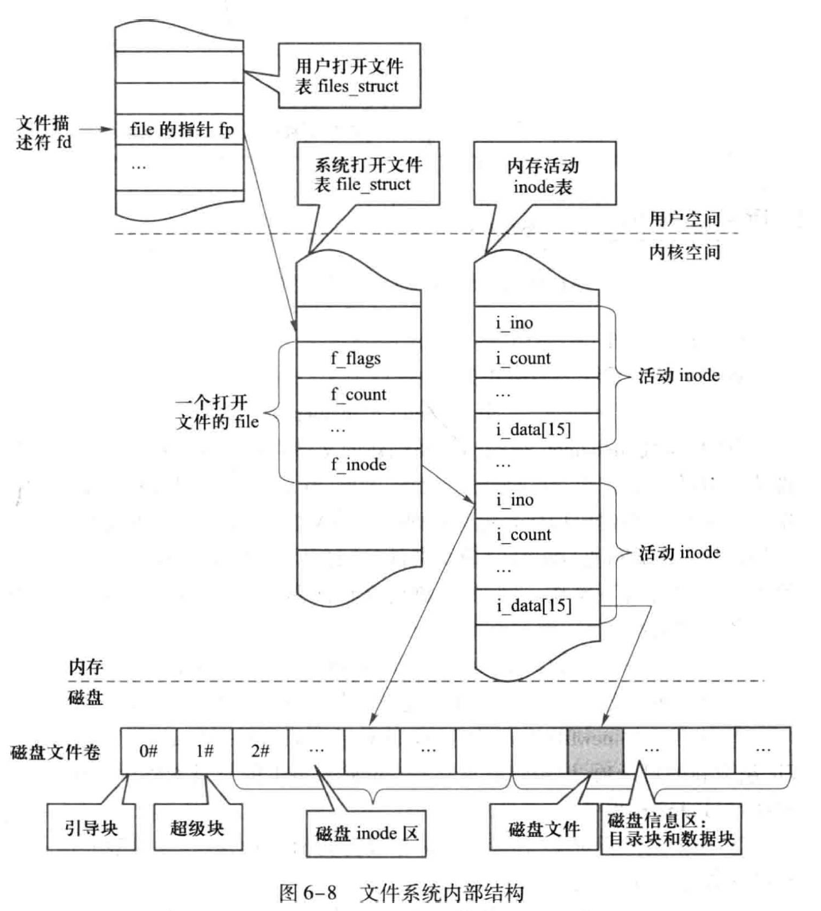

## 5.1. 扇区序列划分

### 5.1.1. 引导块：0号块

### 5.1.2. 超级块：1号块
1. 存放**文件系统结构和管理信息**，如记录inode表所占盘块数、文件数据所占盘块数、主存中登记的空闲盘块数、主存中登记的空闲块物理块号、主存中登记的空闲inode数、主存中登记的空闲inode编号，及其他文件管理控制信息，
2. 可见**超级块**既有**盘位示图**的功能，又记录**整个文件卷的控制数据**。
3. 每当一个块设备作为文件卷
   1. 被安装时，该设备的超级块就要复制到**主存系统区**中备用
   2. 拆卸文件卷时，修改过的超级块需复制回磁盘的超级块中。

### 5.1.3. 磁盘inode(索引节点)区：2-(k+1)号块
1. 一共k个块，k不确定，在磁盘分区的时候确定
2. 存放inode表，每个文件都有**各种属性**，它们被记录在称为索引节点inode的结构中；所有inode都有**相同大小**，且inode表是inode结构的列表，文件系统中的每个文件在该表中都有一个inode。
3. 又分**磁盘inode表和主存活动inode表**，后者解决频繁访问磁盘inode表的效率问题。

### 5.1.4. 磁盘信息(数据)区：(k+2)块及以后
目录块和数据块(目录文件和数据文件的区别)：
1. 文件的内容保存在这个区域，磁盘上所有物理块的大小是一样的
2. 如果文件包含超过一块的数据，则文件内容会存放在**多个盘块**中。

## 5.2. 文件系统磁盘结构
1. **用户打开文件表**：进程的PCB结构中保留一个files_struct，称为**用户打开文件表或文件描述符表**
   1. 表项的序号为文件描述符fd
   2. 该登记项内**登记系统打开文件表的一个入口指针fp**
   3. 通过此系统打开文件表项**连接到打开文件的活动inode**。
2. **系统打开文件表**：是为解决**多用户进程共享文件、父子进程共享文件**而设置的系统数据结构file_struct
   1. 一个文件可能被多个进程同时打开或打开多次，导致位移量不同。
   2. 每次打开就是一个file，多次打开就是多个file。
   3. 一个inode可以连接0个或多个file，多个file对应一个inode。
   4. 内核内存区开辟最多存放256项的系统打开表区。
3. **主存活动inode表**：为解决频繁访问磁盘索引节点inode表的效率问题，系统开辟的主存区，正在使用的文件的inode被调入主存活动索引节点inode中，以加快文件访问速度。

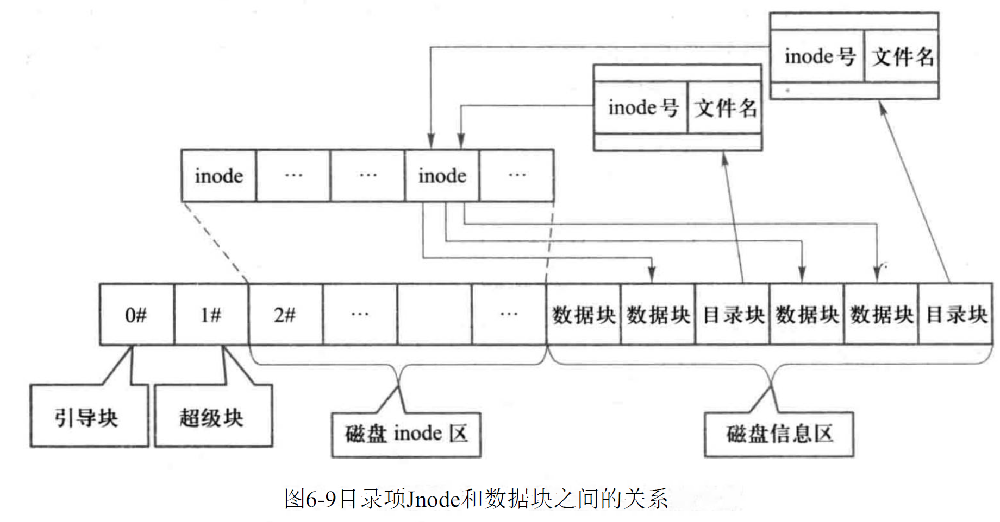

## 5.3. 文件相关操作

### 5.3.1. 文件的使用
1. 用户通过两类接口与文件系统联系
2. 第一类是与文件有关的操作命令，例如，UNIX中的cat，cd，cp，find，mv，rm，mkdir，rmdir等等
3. 第二类是提供给用户程序使用的文件类系统调用，基本文件类系统调用有：建立、打开、读/写、定位、关闭、撤销

### 5.3.2. 创建文件
```c++
int fd;           // 创建成功后系统返回的文件描述符
int mode;         // mode是文件所具有的权限
char *filenamep;  // 指向要创建的文件路径名的字符串指针
fd = create(filenamep, mode);
```

1. 创建成功后，存取权限存放在inode的i_mode中。
2. fd是创建成功后系统返回的**文件描述符**，即用户打开文件表中相应文件表项的序号。
3. create()在创建的同时也**打开**了文件。
4. 创建过程:`create("path", 0775)`
   1. 为新文件newfile分配磁盘inode和活动inode，并把inode编号与文件分量名newfile组成新目录项，记到目录中，这个过程中执行目录检索程序。
   2. 在新文件所对应的活动inode中置初值，如置存取权限i_mode=0775，连接计数i_nlink=1等。
   3. 分配**用户打开文件表项**和**系统打开文件表项**，为后者置初值，包括特征位为写，读写位移f_offset清0。
   4. 把各表项及文件对应的活动inode用指针连接起来
   5. 把文件描述字fd返回给调用者。

### 5.3.3. 文件的删除
1. 删除把指定文件从所在的**目录文件**中除去。
2. 如果没有连接用户(i_link为1)，还要**把文件占用的存储空间释放**。删除系统调用形式为：`unlink(filenamep)`。
3. 在执行删除时，必须要求用户对该文件具有"**写**"操作权。

### 5.3.4. 文件的打开
```c++
int fd, mode;
char * filenamep;
fd = open(filenamep, mode);
```

1. 文件使用前需要打开，以建立进程与文件之间的联系，而文件描述符唯一标识了这种连接，其任务是**把文件的磁盘inode复制到内存活动inode**中去，同时建立一个独立的读写文件数据结构，即系统打开文件表的一个表项。

1. 打开过程：
   1. 检索目录
      1. 如果没有则会出错
      2. 检索到指定文件后，把它的磁盘inode复制到活动inode表中。
      3. 如果inode号**已经**在活动表项中则直接执行下一步。
   2. 根据参数mode核对权限(与创建时的mode)
      1. 如果非法，则这次打开失败。
      2. 当"打开"合法时，为文件分配**用户打开文件表项**和**系统打开文件表项**，并为后者赋初值。通过指针建立这些表项与活动inode间的联系。把文件描述字，即用户打开文件表中相应文件表项的序号返回给调用者。
2. 输入是含路径的文件名 $\rightarrow$ 依据层次式目录结构解释与检索 $\rightarrow$ 匹配文件名并读取目录项 $\rightarrow$ 提取inode号 $\rightarrow$ 按号定位，在inode区读取inode数据结构(主存活动inode)
3. 系统实现上必须有inode号，但是对文件名而言是透明的。

### 5.3.5. 文件的关闭
```c++
int fd;
close(fd);
```

1. 关闭文件时需要释放掉inode来保证空间。
2. 关闭过程
   1. 根据fd找到用户打开文件表项，再找到系统打开文件表项。释放**用户打开文件表项**。
   2. 把对应**系统打开文件表项**中的f_count减1，如果非0，说明还有进程共享这一表项，不用释放直接返回；否则释放表项。
   3. 把活动索引节点中的i_count减1，若不为0，表明还有用户进程正在使用该文件，不用释放而直接返回，否则在把该活动索引节点中的内容复制回文件卷上的相应索引节点中后，**释放**该活动索引节点。
3. f_count和i_count分别反映进程动态地共享一个文件的两种方式
   1. f_count反映**不同进程**通过**同一个**系统打开文件表项共享一个文件的情况；
   2. i_count反映**不同进程**通过**不同**系统打开文件表项共享一个文件的情况。
4. 通过两种方式，进程之间既可用相同的位移指针f_offset，也可用不同位移指针f_offset共享同一个文件。

### 5.3.6. 读文件
```c++
int nr;     // 系统调用后实际读入的字节数
int fd;     // 文件描述符
int count;  // 要求传送的字符
char buf[]; // 应该输入的用户数据区的首地址
nr = read(fd, buf, count);
```

1. 读指将文件的内容读入用户数据区，读入数据的逻辑地址由offset决定
2. 读文件过程
   1. 系统根据f_flag中的信息，检查读操作合法性
   2. 如果合法，再根据当前位移量f_offset值，要求读出的字节数，及活动索引节点中i_addr指出的文件物理块存放地址，把相应的物理块读到缓冲区中，然后再送到buf指向的用户主存区中。

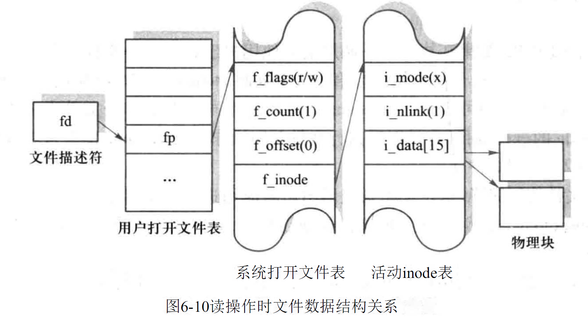

### 5.3.7. 写文件
```c++
int nw;     // 系统调用后实际写入的字节数
int fd;     // 文件描述符
int count;  // 要求传送的字符
char buf[]; // 数据传送的源地址
nw = write(fd, buf, count);
```
1. 写是将用户数据区的数据写入文件中，写入数据的逻辑地址由offset决定

### 5.3.8. 文件的随机存取
1. 在文件初次"打开"时，文件的位移量f_offset清空为0，以后的文件读写操作总是根据offset的当前值，顺序地读写文件。为了支持文件的随机访问，提供系统调用lseek，它允许用户在**读、写文件**前，事先改变f_offset的指向系统调用的形式为：

```c++
long offset;      // 当前的offset
int whence;       // 
int fd;           // 指向一个以读或写方式打开的文档
lseek(fd, offset, whence);
```

2. 文件描述字fd必须指向一个用读或写方式打开的文件
   1. 当whence是0时，则f_offset被置为offset，
   2. 当whence是1时，则f_offset被置为文件当前位置加上offset。

# 6. 文件目录的管理
1. 输入包含路径的文件名(依据层次式的目录和结构解析)
2. 在指定的时候目录块提取改文件的目录项

# 7. 文件共享
1. 文件共享指不同进程共同使用同一个文件，文件共享为不同进程完成共同任务所需。
2. 节省大量外存空间，减少因文件复制而增加的I/O操作次数。

## 7.1. 静态共享
1. 允许一个文件同时属于多个目录，但是实际上文件仅有一处物理存储。
2. 文件链接：从多个目录可到达文件的链接。
3. 无论进程是否运行，文件链接关系都存在，所以称为静态共享。
4. 链接的文件的存在形式：
   1. 同一父目录下的不同文件名出现
   2. 不同父目录下的相同或不同文件名出现

```c++
char* oldnamep;// 指向已存在文件名的字符串的指针
char* newnamep;// 指向文件别名的字符串的指针
link(oldnamep, newnamep);
```

1. 执行步骤
   1. 检索目录找到oldnamep所指向文件的索引节点inode编号。
   2. 再次检索目录找到newnamep所指文件的父目录文件，并把已存在文件的索引节点inode编号与别名构成一个**目录项**，记入到该目录中去。
   3. 把已存在文件索引节点inode的连接计数i_nlink加1。
2. 链接实际上是共享已存在文件的索引节点inode，完成链接的系统调用
   1. link("/home/fei1/myfile.c","/home/fei2/myfile.c")
   2. link("/home/fei1/myfile.c","/home/fei3/fei4/testfile.c")；
3. 执行后，三个路径名指的是同一个文件：
   1. /home/fei1/myfile.c
   2. /home/fei2/myfile.c
   3. /home/fei3/fei4/testfile.c
4. 文件解除链接调用形式为：`unlink(namep)`，解除链接与文件删除执行的是**同一系统调用代码**。
   1. 删除文件是从文件主角度讲的
   2. 解除文件连接是从共享文件的其他用户角度讲的
5. 都要删去目录项，把i_nlink减1，不过，只有当i_nlink减为0时，才真正删除文件。

## 7.2. 动态共享
1. 文件动态共享是系统中**不同的用户进程或同一用户的不同进程**并发访问同一文件。
2. 这种共享关系只有当**用户进程存在**时才可能出现，一旦用户的进程消亡，其共享关系也就自动消失。
3. 文件的每次读写由一个读/写位移指针指出要读写的位置。现在的问题是：应让多个进程共用同一个**读/写位移**，还是各个进程具有各自的读写位移呢？

### 7.2.1. 使用同一位移指针的文件共享
1. 同一用户父、子进程协同完成任务，使用同一读/写位移，同步地对文件进行操作。
2. 该位移指针宜放在相应文件的活动inode中。当用系统调用fork()建立子进程时，父进程的PCB结构被复制到子进程的PCB结构中，使两个进程的打开文件表指向同一活动的索引节点，达到共享同一位移指针的目的。

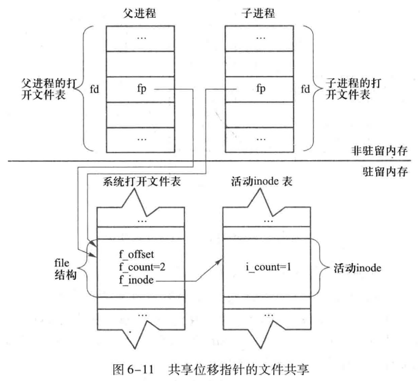

3. 注意f_count = 2表示共享

### 7.2.2. 使用不同位移指针的文件共享
1. 多用户进程共享文件，每个希望独立地读、写文件，这时不能只设置一个读写位移指针，须为每个用户进程分别设置一个**读、写位移指针**。
2. 位移指针应放在每个进程**用户打开文件表**的表目中。
3. 这样，当一个进程读、写文件，并修改位移指针时，另一个进程的位移指针不会随之改变，从而，使两个进程能独立地访问同一文件，会新建系统打开文件表(包含f_offset)

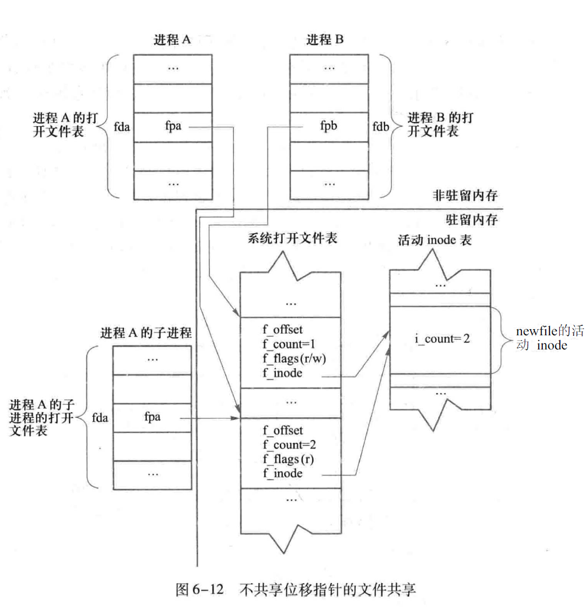

### 7.2.3. 两种方式存在的问题
1. 问题：读写位移指针的位置设置和数目是不同的。
2. 解决：系统建立系统打开文件表，包含读写位移指针f_offset、文件访问计数f_count、读写标志f_flags、指向活动索引节点的指针f_inode

### 7.2.4. 两种方式的实现
1. 使用同一位移指针的文件共享：先打开文件，再fork()
2. 使用不同位移指针的文件共享：先fork()，再打开文件

## 7.3. 符号链接共享
1. 操作系统可支持多个物理磁盘或多个逻辑磁盘(分区)，那么，文件系统是建立一棵目录树还是多棵目录树呢?
   1. 将**盘符或卷标**分配给磁盘或分区，并将其名字作为文件路径名的一部分，比如Windows
   2. **每个分区有自己的文件目录树**，当有多个文件系统时，可通过安装的办法整合成一棵更大的文件目录树，如UNIX/Linux
2. 问题：系统中每个文件对应一个inode，编号是**唯一**的，但**两个不同的磁盘或分区**都含有**相同inode**号对应的文件，也就是说，整合的目录树中，inode号并不唯一地标识一个文件，
3. 办法：拒绝创建跨越文件系统的硬链接。

### 7.3.1. 硬链接
将文件名和自身inode链接起来，只能用于单文件系统，可以文件共享，但是不能目录共享。

### 7.3.2. 软连接(符号链接)
1. 符号链接又称软链接，是一种只有文件名，不指向inode的文件，通过名称引用文件。
2. 符号链接共享文件的实现思想：用户A目录中形式为afile $\rightarrow$bfile，实现A的目录与B的文件的链接。其中只包含被链接文件bfile的路径名而不是它的inode号，而**文件的拥有者才具有指向inode的指针**。
3. 当用户A要访问被符号链接的用户B的文件bfile，且要读"符号链接"类文件时，被操作系统截获，它将依据符号链接中的路径名去读文件，于是就能实现用户A使用文件名afile对用户B的文件bfile的共享。
   1. 优点：能用于链接计算机系统中**不同文件系统**中的文件，可链接计算机网络中不同机器上的文件，此时，仅需提供文件所在机器地址和该机器中文件的路径名。
   2. 缺点：**搜索文件路径开销大，需要额外的空间查找存储路径**。

# 8. 文件空间管理
1. 磁盘等大容量辅存空间被OS及许多用户共享，用户进程运行期间常常要建立和删除文件，OS应能自动管理和控制辅存空间
2. 随着用户文件不断建立和撤销，文件存储空间会出现许多"碎片"
3. OS解决"碎片"的办法是整理"碎片"；在整理过程中，往往对文件重新组织，让其存放在连续存储区中
4. 磁盘文件空间分配采用两种办法
   1. 连续分配：
      1. 文件存放在**辅存空间连续存储区**中，在建立文件时，用户必须给出文件大小，然后，查找到能满足的连续存储区供使用。
      2. **优点**是顺序访问时速度快，管理较为简单，但为了获得足够大的连续存储区，需定时进行"碎片"整理
   2. 非连续分配：
      1. 一种方法是以**块(扇区)**为单位，扇区不一定要连续，同一文件的扇区按文件记录的逻辑次序用链指针连接或位示图指示。
      2. 另一种方法是以**簇**为单位，簇是由**若干个连续扇区**组成的分配单位；实质上是连续分配和非连续分配的结合。各个簇可以用链指针、索引表，位示图来管理。
      3. **优点**是辅存空间管理效率高，便于文件动态增长和收缩

## 8.1. 位示图
1. 磁盘空间通常使用**固定大小**的块，**可方便地用位示图管理，用若干字节构成一张位示图**，其中每一字位对应一个物理块，字位的次序与块的相对次序一致，字位为‘1’表示相应块已占用，字位为‘0’表示该块空闲。
2. 微型机操作系统VM/SP、Windows和Macintosh等操作系统均使用这种技术管理文件存储空间。
3. **主要优点**是：
   1. 每个盘块仅需1个附加位，如盘块长1KB，位示图开销仅占0.012%
   2. 可把位示图全部或大部分保存在主存，再配合现代机器都具有的位操作指令，实现高速物理块分配和去配。

## 8.2. 空闲区表
1. 该方法常用于**连续文件**，将空闲存储块的位置及其连续空闲的块数构成一张表。
2. 分配时，系统**依次扫描**空闲区表，寻找**合适的空闲块**并修改登记项；
3. 删除文件释放空闲区时，把空闲区位置及连续的空闲区长度**填入空闲区表**，出现邻接的空闲区时，还需执行**合并操作**并修改登记项。
4. 空闲区表的搜索算法有**首次适应、邻近适应、最佳适应和最坏适应算法**等。

## 8.3. 空闲块链
1. 把所有空闲块连接在一起，系统保持**指针指向第一个空闲块**，每一空闲块中包含指向**下一空闲块的指针**。
2. 申请一块时，从链头取一块并修改系统指针；
3. 删除时释放占用块，使其成为空闲块并将它挂到空闲链上。
4. 这种方法**效率低**，每申请一块都要读出空闲块并取得指针，申请多块时要**多次读盘**，但便于文件**动态增长和收缩**。

## 8.4. 补充：空闲块列表
1. 把所有空闲块物理地址放到一个空闲块列表文件中，由于它非常庞大，不可能全部保存在内存中，有两种有效技术可以把该列表的**一小部分**保存在内存中。
   1. 列表用一个下推栈实现，栈中靠前数千个元素保留在内存专用区中。当分配一个新空闲块时，从栈顶弹出；当一个物理块被解除分配时，它被压入内存专用区的栈尾中。只有当下推栈中在内存的部分满或者空时，才需要在内存和磁盘之间进行传送。因此，该技术在大多数时候都提供了零时间的访问。
   2. 列表用一个FIFO队列实现，队列头和队列尾的几千项放在内存专用区中。分配空闲块时从队列头取出首项，取消分配时可以把它添加在内存专用区队列尾。只有当内存中的队列头部空或者内存中的队列尾部满时，才需要在磁盘和内存之间进行传送。
2. 如上两个策略，可以用后台线程来完成排序。

## 8.5. 补充：成组空闲块链
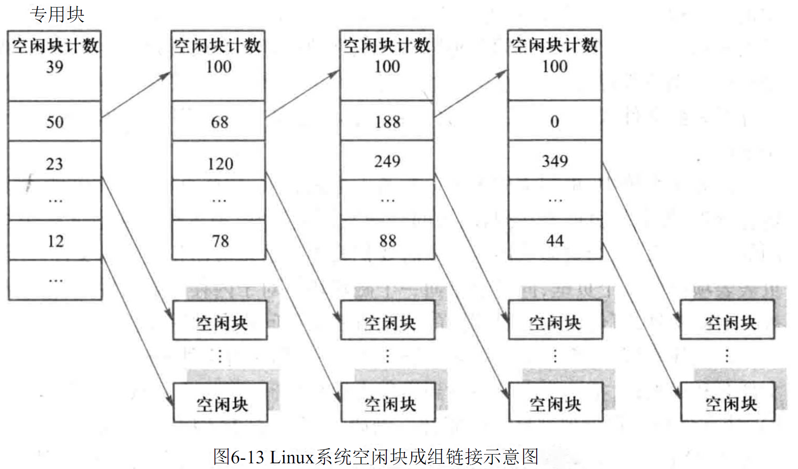

1. 图6-13给出Linux系统所采用的空闲块成组链接法。磁盘物理块长为1024B。为了方便讨论，假定文件卷启用时共有可用空闲块338块，目前空闲块分成4组，39块空闲块已在内存专用块中，剩余每100块划分成一组，每组中第一块(图中盘块号为50、68和188)登记下一组空闲盘块号和空闲块总数。需要注意，在最后一组中，第1项是0，作为结束标志，表明系统空闲盘块链已经结束。
2. 操作系统启动时，将磁盘专用块复制到内存系统工作区中，访问内存专用块就可完成申请或释放空闲盘块的操作。
3. 分配空闲磁盘块时，总是先把专用块中的空闲块计数减1，以它为指针找到专用块的相应表项，其内容就是要分配的空闲磁盘块号。
4. 当空闲块计数减1后等于0时，专用块中仅剩1个磁盘块号，此时要取出表项中的磁盘块号(设为i)，再把此盘块中所保存的下一组空闲磁盘块链接信息经缓冲区复制到内存专用块中，然后把当前磁盘块分配出去。
5. 释放存储块时，将磁盘块号记录在由专用块所指示的表项中，然后空闲块计数加1。若发现此表已满(达100项)，则应把整个表的内容经缓冲区复制到下面要释放的磁盘块中，然后将释放块的块号写入专用块中的第一个位置，置空闲块计数为1。
6. 搜索到磁盘块中的第1项是0时，系统应向操作员发出警告，表明空闲块已经用完。
7. 需要注意，开始时空闲块是按序排列的，操作系统经过一段时间运行，文件系统中的空闲块号未必能保持连续，但只要符合分组及组间连接的原则，空闲块可按任意次序排列。事实上，经过若干次分配和释放操作后，空闲块物理块号必定不再按序排列。

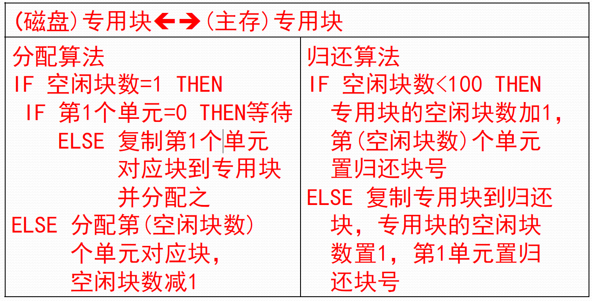

# 9. 文件的安全与保护

## 9.1. 文件的安全
1. 文件是计算机系统的重要资源，因此，要求文件系统具有**保障文件安全**的手段，提供文件保密的措施，有效地实现文件的共享
   1. **文件共享**是指不同用户共同使用某些文件
   2. **文件保护**是指防止文件被破坏
   3. **文件保密**则是指防止文件及其内容被其他用户窃取

### 9.1.1. 文件共享
1. 文件共享是计算机用户完成**共同任务**所必需的
2. 文件共享带来**许多好处**，如：减少用户大量重复性劳动；免除系统复制文件的工作；节省文件占用的存储空间；减少程序设计输入输出文件的次数

### 9.1.2. 文件共享的并发控制
1. 在允许文件共享的系统中，操作系统应提供手段实现对**共享文件的同步控制**
2. 多个进程可能**同时**存取一个文件，如果它们同时进行读操作，操作系统应对文件进行公用控制
3. 如果有进程进行**写操作**，例如，有两个进程，进程A要求修改文件，同时进程B要求读出同一文件中的数据，则操作系统必须提供**同步控制**机制，以保证文件数据的完整性

### 9.1.3. 文件的保密措施
1. 文件保密是指**文件及其内容不能被未经文件主授权的其他用户**窃取
2. 文件的保密措施有以下几种：
   1. **隐蔽文件目录**
   2. **设置口令**
   3. **使用密码**：避免高级技能用户直接访问磁盘数据

## 9.2. 文件的保护
1. **文件保护**是指防止文件被破坏
2. 操作系统必须提供文件保护机制，有效实现文件的完整性
3. 常用的文件保护办法
   1. 文件副本
   2. 文件存取矩阵与文件存取表
   3. 文件属性

### 9.2.1. 文件的副本
1. 文件系统必须要有防止硬软件故障，保存信息完整性的能力
2. 文件副本是主要实现机制
   1. 动态多副本技术
   2. 转储、备份与恢复

#### 9.2.1.1. 动态多副本
1. 第一种办法是在**多个介质上维持同一内容的文件**，并且在更新内容时**同时**进行
2. 这种方法需要增加设备费用和系统负载一般适用于容量较小且较为重要的文件，例如不需更新的系统文件及专用文件，当文件发生故障时只要切换到备用设备就可

#### 9.2.1.2. 文件转储
1. 文件转储：定时把文件**复制转储到其它介**质上，当某介质上出现故障时，复原转储文件
2. 转储又可分成两种方式：
   1. 一是在一定时间间隔或一个单位处理结束时，系统**自动**复写更新过的文件和数据
   2. 二是**每天或每周**把文件信息全部复写一遍，需要时再通过装入转储文件来恢复系统，诸如BACKUP、RESTORE等命令

### 9.2.2. 文件的存取控制矩阵
1. 系统为每个用户设置访问每个文件对象的存取属性
2. 系统的全部用户对全部文件的存取属性就组成的一个二维矩阵，称为存取控制矩阵

$$
\begin{bmatrix}
  a_{11} & a_{12} & ... & a_{1n} \\
  a_{21} & a_{22} & ... & a_{2n} \\
  . & . & ... & . \\
  a_{n1} & a_{n2} & ... & a_{nn} \\
\end{bmatrix}
$$

### 9.2.3. 存取控制表
1. 由于操作系统拥有很多用户和众多文件，存取控制矩阵是一个**稀疏矩阵**，可以将其简化为一张**存取控制表**
2. 每行包括：**用户、文件、存取属性**
3. 存取控制表仅登记那些对文件拥有存取属性的部分

### 9.2.4. 基于存取控制矩阵/表的文件保护
1. 存取属性：可以有访问、读、写、执行、创建、删除、授权等等
2. 系统通过查阅(矩阵/表)核对用户对文件的存取权限
3. 文件属主使用GRANT、REVOKE等命令进行授权，甚至把授权权转授给他信任的用户
4. 系统管理用户(超级用户)等同于文件属主权限，并获得对系统文件的授访问权权限

# 10. 补充：内存映射文件
1. 内存映射文件的原理如下:把进程需要访问的文件映射到其虚地址空间中，于是便可通过读写这段虚地址进行文件访问，而磁盘访问转变成内存访问。也就是说，把磁盘中的文件视为进程的虚地址的一部分， 故也称映射文件I / O 。内存映射文件是按照文件名来访问的，多个进程可同时把同一个文件映射到各自的虚地址空间中，且虚地址不必相同。随着进程的运行，被引用的映射文件由存储管理程序装人内存，多个进程读写虚存的映射文件区就可以共享文件信息。其优点是方便易用，节省空间，便于共享，利于通信。
2. 详见P326

# 11. 补充：文件系统的性能与可靠性
详见P330

## 11.1. 文件系统性能问题措施
1. 盘块高速缓存：局部性原理；写回优化
2. 数据预先读入：仅适用于顺序访问
3. 信息优化分布：磁盘上的信息优化分布
4. 磁盘驱动调度：不同驱动调度算法
5. 内存映射文件：将内存访问转换为内存访问，将想要访问的文件映射到进程的虚存空间，特别适用于文件共享场景。

## 11.2. 提高文件可靠性措施
1. 磁盘坏块管理：软硬件解决方案
2. 备份数据：完全、增量和更新备份

## 11.3. 文件系统一致性检查
1. 磁盘块一致性检查：磁盘块要么占用要么空闲
2. 文件一致性检查：关注inode，出现无法释放等问题

# 12. 文件系统的实现层次
|  | 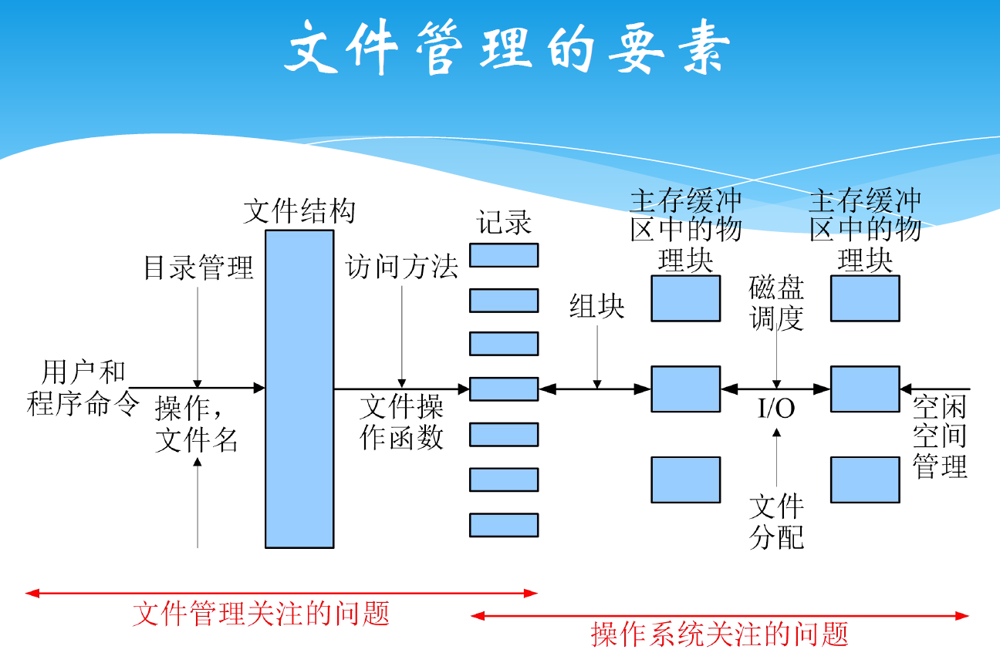 |
| -------------------- | -------------------- |
